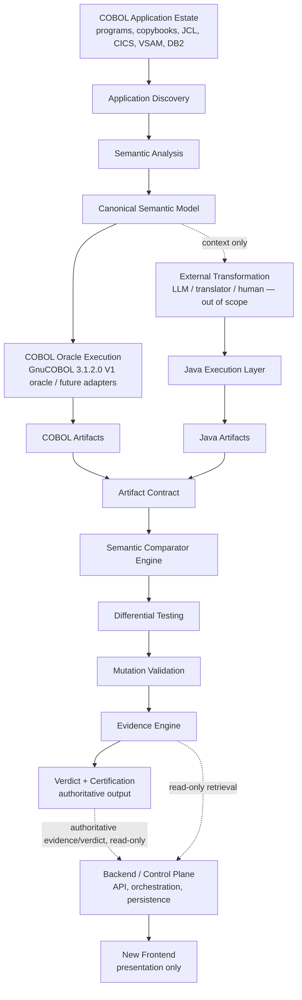
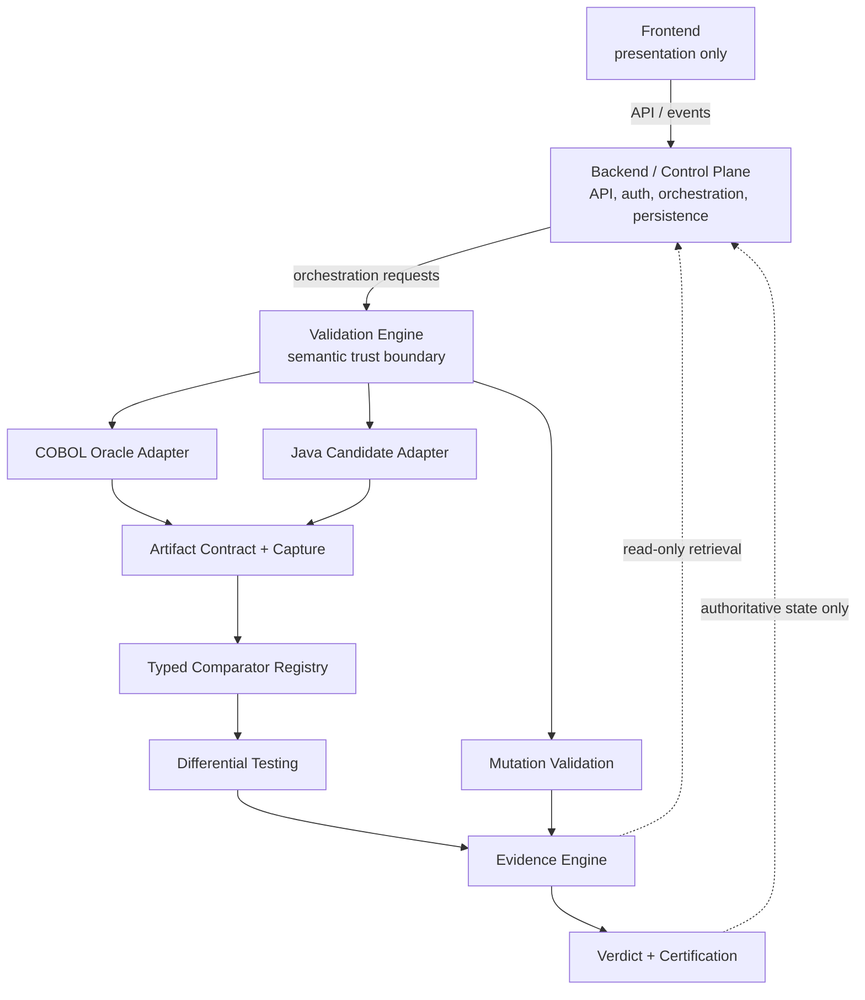
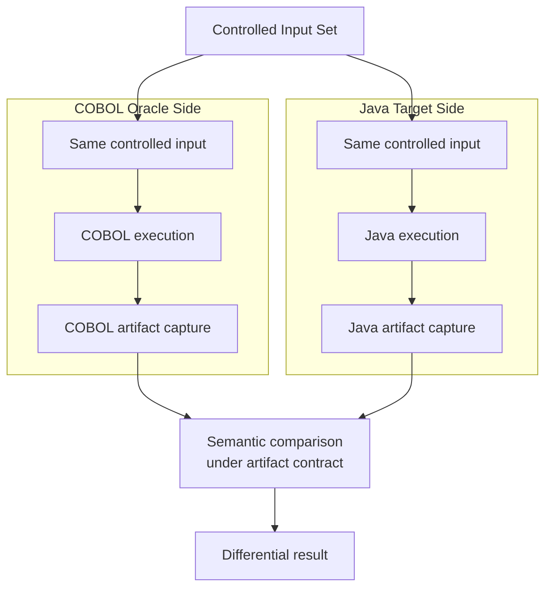
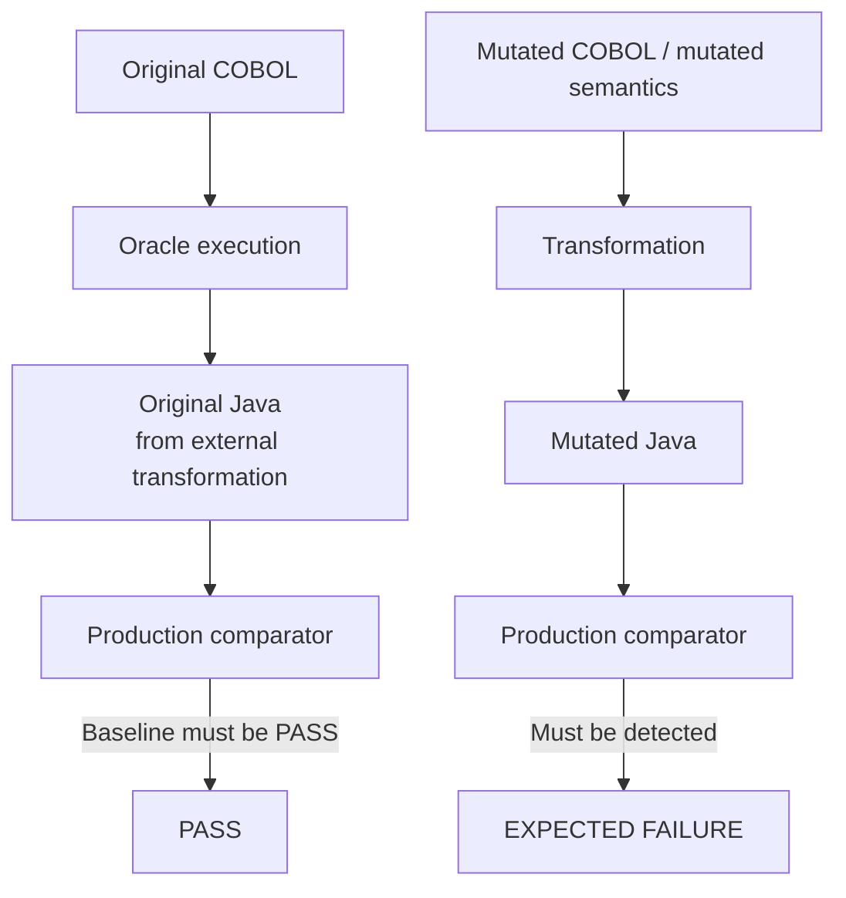
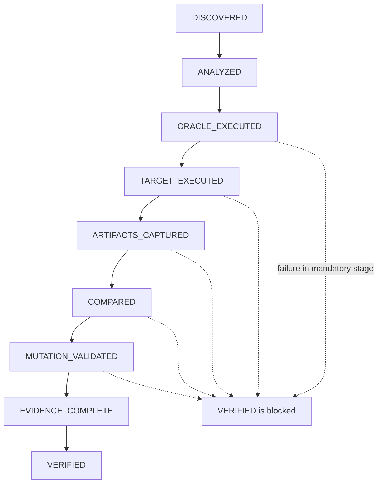
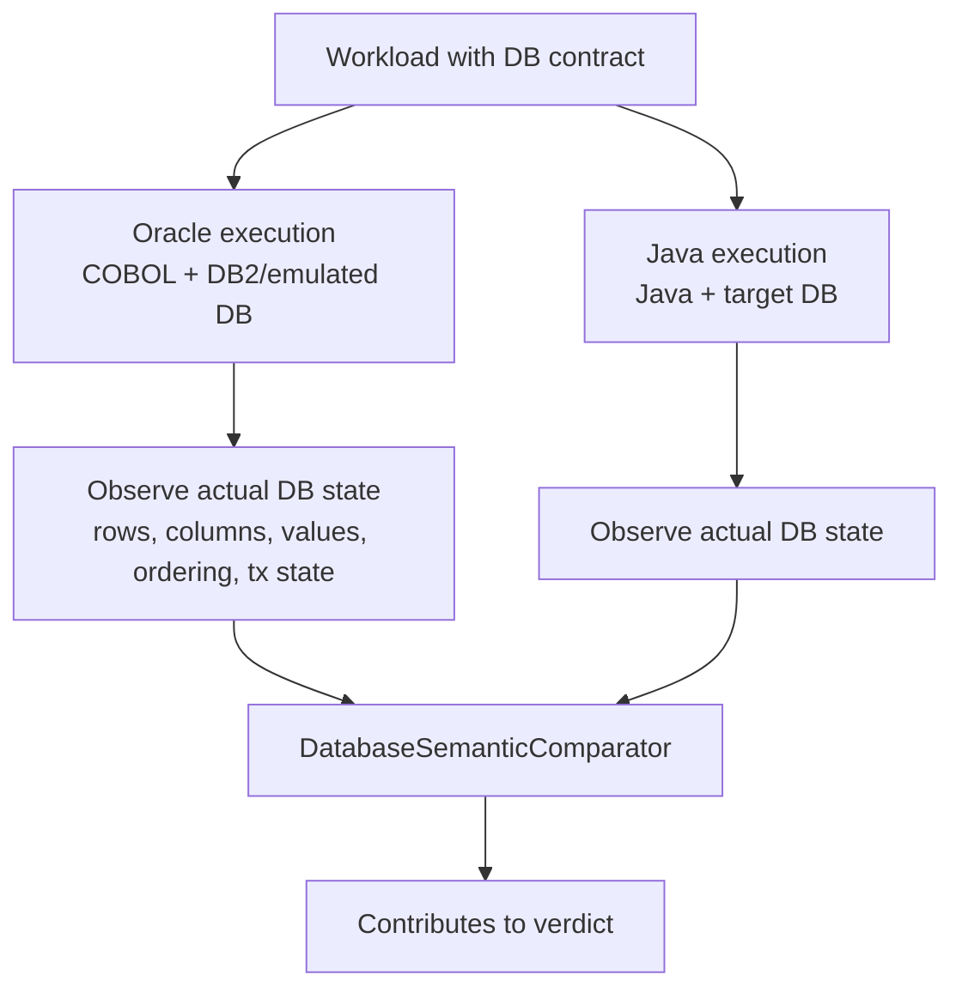
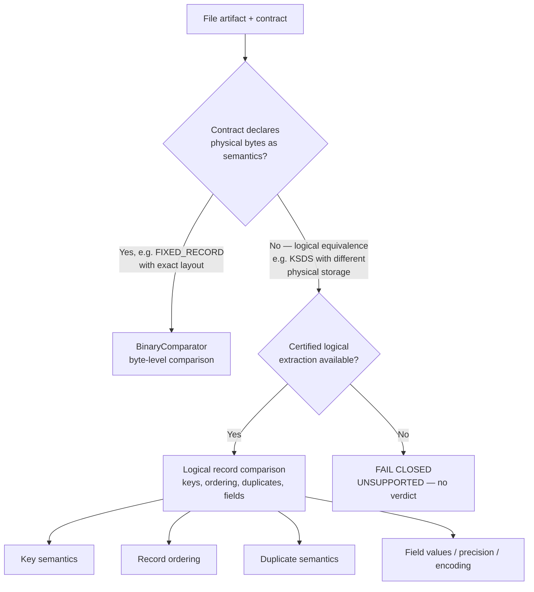
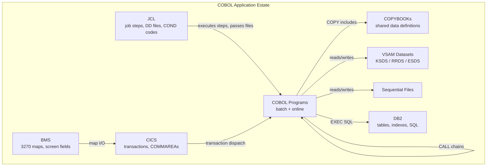
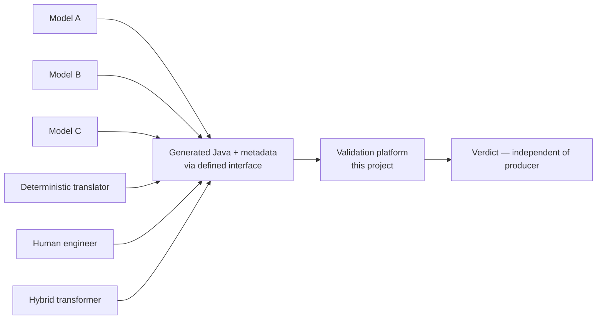
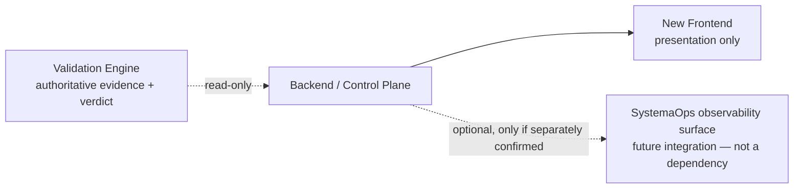

# Cobol-Java-Transformation

**An enterprise-grade COBOL modernization validation and business-equivalence platform.**

> **REPOSITORY STATUS: GREENFIELD — PHASE 1C COMPLETE (CONTRACT FOUNDATION);
> AWAITING CONTRACT VALIDATION + IMPLEMENTATION AUTHORIZATION.**
> Phase-0 discovery COMPLETE · Phase-1A decision package COMPLETE · Phase-1B owner
> approvals COMPLETE (all eight P0 records + DR-16/17/18/20; DR-19/31 deferred) ·
> Phase-1C contracts DRAFTED AND AUTHORITATIVE:
> [ORACLE_CONTRACT](contracts/ORACLE_CONTRACT.md) ·
> [ARTIFACT_CONTRACT_SPEC](contracts/ARTIFACT_CONTRACT_SPEC.md) ·
> [VERDICT_CONTRACT](contracts/VERDICT_CONTRACT.md) ·
> [JAVA_CANDIDATE_CONTRACT](contracts/JAVA_CANDIDATE_CONTRACT.md) ·
> [TRANSFORMATION_PRODUCER_CONTRACT](contracts/TRANSFORMATION_PRODUCER_CONTRACT.md)
> + ADRs 0001-0008. **No production implementation exists or is authorized yet.**
> Every capability remains **PLANNED** or **UNPROVEN** until this repository itself
> contains implementation and execution evidence.
>
> **This is the authoritative architecture/discovery document.** It separates what
> is confirmed, what is proposed, and what remains unknown (see
> [Documentation and Decision Discipline](#documentation-and-decision-discipline)). It
> makes no implementation claims.

| | |
|---|---|
| **Repository** | https://github.com/Shankar373/Cobol-Java-Transformation |
| **Project type** | Greenfield — independent COBOL modernization *validation* and business-equivalence platform |
| **Product identity** | **[UNKNOWN — pending owner decision, Q1/DR-19].** The architectural identity ("independent COBOL modernization validation and business-equivalence platform") is retained until the owner decides otherwise. |
| **Predecessor (forensic reference)** | `Cobol-to-java-test` / `cobol-java-modernization` — the owner's own previous implementation, used strictly as a forensic learning base, failure corpus, and benchmark source. Not an architectural template; not inherited software. |
| **Current state** | Phase 1C complete: architecture decisions confirmed (ADRs 0001-0008), five contracts drafted and authoritative, owner approvals recorded. Still documentation-only — no application, parser, comparator, execution framework, tests, CI, Docker/runtime infrastructure, or UI exists in this repository. Production implementation not yet authorized. |
| **Primary engineering responsibility** | Business equivalence, testing, validation, execution, evidence, certification, and enterprise-grade application engineering |

---

## Table of Contents

1. [Executive Summary](#executive-summary)
2. [Project Mission](#project-mission)
3. [Problem We Are Solving](#problem-we-are-solving)
4. [Why COBOL Modernization Is More Than Translation](#why-cobol-modernization-is-more-than-translation)
5. [Project Ownership and Responsibilities](#project-ownership-and-responsibilities)
6. [Core Engineering Principles](#core-engineering-principles)
7. [Business Equivalence](#business-equivalence)
8. [Testing and Validation Philosophy](#testing-and-validation-philosophy)
9. [Architectural Lessons From the Previous Project](#architectural-lessons-from-the-previous-project)
10. [High-Level Architecture](#high-level-architecture)
11. [Application Discovery](#application-discovery)
12. [Semantic Understanding](#semantic-understanding)
13. [COBOL Oracle](#cobol-oracle)
14. [Java Execution](#java-execution)
15. [Artifact Contract](#artifact-contract)
16. [Comparator Engine](#comparator-engine)
17. [Differential Testing](#differential-testing)
18. [Mutation Testing](#mutation-testing)
19. [Golden Master and Baselines](#golden-master-and-baselines)
20. [Evidence Engine](#evidence-engine)
21. [Verdict Engine](#verdict-engine)
22. [Evidence State Machine](#evidence-state-machine)
23. [Database Validation](#database-validation)
24. [VSAM and File Validation](#vsam-and-file-validation)
25. [CALL and Multi-Program Validation](#call-and-multi-program-validation)
26. [JCL / CICS / BMS / DB2](#jcl--cics--bms--db2)
27. [Reproducibility](#reproducibility)
28. [Security and Isolation](#security-and-isolation)
29. [Enterprise-Grade Requirements](#enterprise-grade-requirements)
30. [Industrial Benchmark](#industrial-benchmark)
31. [LLM / Transformation Boundary](#llm--transformation-boundary)
32. [Model Evaluation](#model-evaluation)
33. [SystemaOps Integration](#systemaops-integration)
34. [Target Repository Architecture](#target-repository-architecture)
35. [Development Roadmap](#development-roadmap)
36. [First Vertical Slice](#first-vertical-slice)
37. [Capability Matrix](#capability-matrix)
38. [Known Semantic Failure Classes](#known-semantic-failure-classes)
39. [Reuse of Previous Project](#reuse-of-previous-project)
40. [Non-Reusable Legacy Patterns](#non-reusable-legacy-patterns)
41. [Definition of Done](#definition-of-done)
42. [Anti-Patterns](#anti-patterns)
43. [Architecture Discovery Findings](#architecture-discovery-findings)
44. [Decision Register](#decision-register)
45. [Architecture Decisions Pending](#architecture-decisions-pending)
46. [Implementation Blockers](#implementation-blockers)
47. [Documentation Roadmap](#documentation-roadmap)
48. [Current Status](#current-status)
49. [Future Vision](#future-vision)
50. [Conclusion](#conclusion)

---

## Executive Summary

Large enterprises run critical business functions on decades-old COBOL estates. Modernizing
these estates to Java is now frequently attempted with LLM-based and automated transformation
systems. However, the industry repeatedly encounters the same failure pattern:

> A transformation produces Java that **compiles, passes a handful of unit tests, and looks
> structurally similar to the COBOL source** — and is then declared "equivalent" — while
> actually diverging from the original business behavior in ways that only surface in
> production, sometimes catastrophically.

The root cause is structural: **the same system that generates the Java is also asked to
vouch for its correctness.** A generator — whether an LLM, a deterministic transpiler, or a
human engineer — cannot independently certify its own output.

**Cobol-Java-Transformation** is being built as the independent counterparty: an
enterprise-grade **validation and business-equivalence platform** whose sole purpose is to
determine, with reproducible and auditable evidence, whether a COBOL-to-Java transformation
preserves the **defined business behavior** of the original COBOL application estate.

The platform is architected around a strict ownership boundary:

- The **transformation** (LLM-based or otherwise) is owned by another team and is treated as
  an external producer of candidate Java.
- **This project** owns verification: controlled execution, artifact capture, semantic
  comparison, differential testing, mutation validation, evidence collection, and
  certification verdicts.

The design is directly informed by the owner's own predecessor project, which performed
LLM-assisted COBOL-to-Java modernization end-to-end. That project — including its
authoritative post-remediation forensic audit — surfaced real false-PASS mechanisms,
comparator vulnerabilities, semantic defect classes, and certification failures. All of
these are captured here as hard architectural requirements (see
[Architectural Lessons From the Previous Project](#architectural-lessons-from-the-previous-project)).

**What this project is NOT:**

- It is not a COBOL-to-Java converter (see the [ownership boundary](#project-ownership-and-responsibilities)).
- It is not a test-count or line-count exercise.
- It is not a UI-first product.
- It does not assume generated Java is correct because it compiles, because a model produced
  it, or because a baseline exists.
- It is not a copy or continuation of the predecessor's architecture: the predecessor is
  treated strictly as a forensic knowledge base, and its architecture is **not** an
  architectural template for this project.

**Governing principle:**

> **TRANSFORMATION IS NOT VERIFICATION.**

### Documentation and decision discipline

Everything in this README is classified. The labels are binding:

| Label | Meaning |
|---|---|
| **[FACT]** | Verified from repository/evidence. |
| **[DECISION]** | Explicitly confirmed by the owner. |
| **[PROPOSAL]** | Architectural recommendation not yet confirmed. |
| **[ASSUMPTION]** | Something that must not silently become a decision. |
| **[UNKNOWN]** | Requires an owner decision. |

Confirmed decisions are listed in the [Decision Register](#decision-register) with status
`CONFIRMED`; everything architectural that is not yet owner-confirmed appears there as
`PROPOSED`, `OPEN`, `BLOCKED`, `OUT OF SCOPE`, or `FUTURE`. No proposal in this document
has been silently promoted to a decision.

---

## Project Mission

> Build an enterprise-grade COBOL modernization validation and business-equivalence platform
> capable of independently determining whether a COBOL-to-Java transformation preserves the
> defined behavior of a real COBOL application estate.

The mission explicitly goes beyond "convert COBOL to Java." The platform exists to make COBOL
modernization **trustworthy** by treating verification as a first-class engineering product
with the same rigor as the transformation itself — more rigor, in fact, because the
validation platform is the last line of defense before behavior differences reach production.

The platform must eventually support the full validation lifecycle:

```text
COBOL application
        |
        v
Application understanding
        |
        v
COBOL Oracle execution
        |
        v
Business artifacts
        |
        +--------------------------+
                                   |
Generated Java --------------------+   (from external transformation)
        |
        v
Java execution
        |
        v
Java artifacts
        |
        v
Artifact-aware semantic comparison
        |
        v
Business-equivalence validation
        |
        v
Mutation validation
        |
        v
Evidence collection
        |
        v
Certification / verdict
        |
        v
Backend / control plane (authoritative-state retrieval)
        |
        v
New frontend (presentation only)
        |
        (SystemaOps = optional future integration surface,
         never the engine's control plane — DR-29)
```

---

## Problem We Are Solving

### The verification gap

Modern COBOL-to-Java transformation efforts concentrate effort on **generation** and treat
verification as a downstream afterthought — typically a handful of unit tests on the
generated code. This creates a systematic verification gap:

| Question the industry asks | What is actually required |
|---|---|
| "Does the Java compile?" | Compilation proves nothing about business behavior. |
| "Do some unit tests pass?" | Unit tests prove only what they exercise — usually a fraction of COBOL behavior. |
| "Does stdout match in one test?" | stdout is one artifact among many: files, DB state, exit codes, stderr, side effects. |
| "Does the code look like the COBOL?" | Source similarity is not behavioral evidence. |
| "Does the model say it's equivalent?" | An LLM cannot certify its own transformation. |

### The false-PASS problem

The predecessor project demonstrated concretely that validation infrastructure itself can
harbor defects that **certify wrong behavior as correct**:

- Generic substring-containment comparators that pass when they should fail.
- Baseline reuse that silently compares stale or even self-identical artifacts.
- Skipped checks that report as green.
- Missing artifacts treated as empty-but-successful.
- Mutation tests that bypass the real production comparison path and thus prove nothing
  about the validator.

Each of these is documented in
[Architectural Lessons From the Previous Project](#architectural-lessons-from-the-previous-project)
and becomes a hard requirement in this platform's design.

### The enterprise reality

Real COBOL estates are not single `.CBL` files. They are interconnected systems of COBOL
programs, COPYBOOKs, JCL, CICS transactions, BMS maps, VSAM datasets, DB2 tables, and
cross-program CALL chains — with decades of accumulated edge-case behavior. Any validation
approach that ignores this interconnectedness validates a fiction.

---

## Why COBOL Modernization Is More Than Translation

COBOL carries business semantics that do not map trivially to Java:

- **Data semantics:** `PIC` clauses, implied decimals, `COMP-3` packed decimal, `REDEFINES`
  storage overlays, `OCCURS DEPENDING ON`, space-padded fixed-length comparison, truncation
  and `ROUNDED` behavior, `ON SIZE ERROR` handling.
- **File semantics:** Sequential, line-sequential, indexed (KSDS), relative (RRDS), and
  entry-sequenced (ESDS) datasets — each with distinct key, ordering, duplicate, and status
  semantics.
- **Arithmetic semantics:** `DIVIDE INTO` vs `DIVIDE BY`, `REMAINDER` clauses, intermediate
  precision, truncation rules that differ sharply from Java's `double`/`int` defaults.
- **SQL semantics:** Host-variable binding, `SQLCODE`/`SQLSTATE` behavior, NULL handling,
  cursor semantics, transaction boundaries.
- **Program semantics:** `CALL` with `BY REFERENCE`/`BY CONTENT`/`BY VALUE`, parameter
  write-back, dynamic call dispatch, multi-program workloads.
- **Estate semantics:** JCL step sequencing and return codes, CICS transaction flow, BMS
  screen maps, dataset relationships.

A transformation that compiles and "looks right" can be silently wrong on any of these
dimensions. Determining whether the business behavior survived the translation is a
**separate engineering discipline** from performing the translation — and that discipline is
this project.

---

## Project Ownership and Responsibilities

### MOST IMPORTANT OWNERSHIP BOUNDARY

> **The LLM-based COBOL-to-Java transformation is owned by another person/team.**
>
> **This project owns everything else around that boundary.**

**[DECISION — CONFIRMED]** The complete ownership split:

**THIS PROJECT OWNS (the validation/evidence platform):**

- COBOL ingestion and source discovery
- semantic analysis and canonical representations (to the depth decided in DR-10)
- workload modeling and dependency analysis
- execution framework
- COBOL oracle integration (adapters)
- Java execution of externally generated Java
- artifact capture
- artifact contracts
- semantic projection and semantic comparison
- comparator registry
- differential testing
- mutation validation
- baseline management
- evidence generation and provenance
- verdict engine and certification
- reproducibility
- security/isolation
- observability
- APIs and CLI
- optional future external integration surfaces (including SystemaOps, if separately confirmed as one)
- CI/CD, testing, benchmark infrastructure, documentation, deployment architecture, and
  enterprise-grade engineering

**THE OTHER PERSON/TEAM OWNS:**

- LLM-based COBOL-to-Java transformation integration ONLY

**[DECISION — CONFIRMED]** The transformation producer must remain:

- **external** — never a component of this platform
- **replaceable** — swapping producers must not change the validation architecture
- **untrusted** — its output is input to validation, never evidence
- **producer-agnostic** — see below

The platform must validate Java produced by any of:

- LLM A
- LLM B
- another LLM
- a deterministic translator
- a human developer
- a hybrid transformation pipeline

The validation platform must **not** depend on: model provider, model name, prompt, LLM
framework, agent framework, or any transformation-internal implementation. If the producer
supplies useful metadata, it is consumed through an explicit, contractual, optional
interface (see [DR-14](#decision-register)) — never as a dependency.

Consequences of this boundary:

1. Generated Java is an **external input** to this platform, not a product of it.
2. The platform must be **producer-agnostic**: it must validate Java from any producer
   without knowing or caring which producer generated it.
3. The platform must never assume generated Java is correct because:
   - an LLM generated it
   - it compiles
   - a unit test passes
   - source code looks similar
   - a model says it is equivalent
   - stdout matches in one test
   - a baseline exists
   - a capability is declared
   - an environment variable exists
   - a test is skipped
   - an expected result was hardcoded

The platform's single question is:

> **"Does the generated Java preserve the defined business behavior of the original COBOL
> application?"**

— answered exclusively through controlled execution, artifact capture, semantic comparison,
testing, mutation, and evidence.

---

## Core Engineering Principles

> ## **TRANSFORMATION IS NOT VERIFICATION.**
>
> The transformation system generates/proposes Java.
> The validation platform independently evaluates whether that Java preserves COBOL behavior.

The following principles are binding on every component of this platform:

| # | Principle | Meaning |
|---|---|---|
| 1 | **No execution evidence → no verification.** | Claims must trace to captured execution artifacts, never to inspection or inference. |
| 2 | **No artifact contract → no artifact equivalence claim.** | Comparing artifacts without a declared contract is ungrounded. |
| 3 | **Unknown is not PASS.** | Anything not exercised remains explicitly unknown. |
| 4 | **Unavailable is not VERIFIED.** | Missing infrastructure yields `UNAVAILABLE`, never a green result. |
| 5 | **Compilation success is not business equivalence.** | A build is a build. Behavior is behavior. |
| 6 | **Test success is evidence only for what the test actually exercised.** | No extrapolation. |
| 7 | **An LLM cannot certify its own transformation.** | Certification is independent of the producer. |

---

## Business Equivalence

### Definition

> **Business equivalence** is the ability to demonstrate, for a **defined workload, input
> set, environment, and artifact contract**, that the target Java application's observable
> business behavior is equivalent to the source COBOL application's observable behavior.

Every term in this definition is load-bearing:

- **Defined workload** — equivalence is claimed per workload, never globally.
- **Input set** — the exact controlled inputs used, captured in evidence.
- **Environment** — oracle runtime, Java runtime, database, configuration.
- **Artifact contract** — the declared set of observable artifacts and how each is compared.
- **Observable business behavior** — what the application actually does, not how its source
  text is written.

### The observable surface

Equivalence can involve any of the following artifacts and properties:

- stdout, stderr, exit status
- text files
- fixed-record files
- sequential files
- indexed files / KSDS
- relative files / RRDS
- binary files
- database state
- SQLCODE / SQLSTATE
- error state
- transaction state
- record ordering
- duplicate semantics
- key semantics
- field values
- numeric precision
- formatting
- encoding
- file status
- side effects

### Business equivalence is not necessarily byte equality

The single most important conceptual distinction in this platform:

> **physical representation ≠ business semantics**

Example: COBOL may store a VSAM KSDS dataset as a binary physical container on DASD. Java
may store equivalent logical records in a different persistence representation. Comparing
the raw bytes of the two containers would produce false failures; ignoring the files would
produce false passes. The correct comparison is on the **logical records** — keys, key
ordering, duplicate semantics, field values — as defined by an explicit **artifact
contract**.

Therefore:

- Byte equality is the correct strategy **only when the contract declares physical
  representation as part of the business semantics** (e.g., a fixed-record output file with
  an exact byte layout).
- For datasets where the two sides use different physical representations, the platform must
  compare the **correct logical representation**, extracted by a certified logical
  representation/extraction layer, per the declared contract.
- No comparator may silently choose a weaker strategy (e.g., substring containment) when a
  declared contract demands semantic equality.

---

## Testing and Validation Philosophy

### Testing is a first-class product capability

Testing is not an afterthought in this project. **Testing and validation ARE the product.**
The platform's value is the trustworthiness of its verdicts — and that trustworthiness is
itself established by layered, classified, adversarial testing of the platform.

The project must eventually provide these test layers:

| # | Layer | Purpose |
|---|---|---|
| 1 | Unit tests | Isolated correctness of platform components. |
| 2 | Parser/semantic tests | COBOL analysis correctness (when the semantic layer exists). |
| 3 | IR tests | Canonical semantic model fidelity. |
| 4 | Transformation validation | Validation of externally produced Java, producer-agnostic. |
| 5 | Integration tests | Cross-component platform behavior. |
| 6 | Oracle execution tests | Oracle adapter correctness and evidence capture. |
| 7 | Java execution tests | Java execution layer correctness and evidence capture. |
| 8 | Differential tests | COBOL vs Java behavior under controlled inputs. |
| 9 | Business-equivalence tests | Full equivalence workflow on defined workloads. |
| 10 | Negative tests | The platform MUST reject corrupted, mismatched, missing, and manipulated evidence. |
| 11 | Mutation tests | The platform MUST detect injected behavioral differences through the real production path. |
| 12 | Regression tests | Known defect classes never silently return. |
| 13 | Artifact comparison tests | Comparator correctness per artifact type and contract. |
| 14 | Evidence integrity tests | Manifests are complete, tamper-evident, and reconstructable. |
| 15 | Certification tests | Verdict logic is strict; SKIP/UNAVAILABLE/0-checks never produce green. |
| 16 | Reproducibility tests | Re-running with pinned inputs reproduces identical verdicts. |
| 17 | Environment/adapter tests | Adapter status reporting (AVAILABLE/UNAVAILABLE/FAILED/SUCCEEDED) is honest. |
| 18 | End-to-end enterprise workload tests | The full lifecycle on realistic multi-artifact workloads. |

### Test count is not test strength

> **A large test count does not automatically mean strong validation.**

Tests must be classified by **strength and purpose**:

- A thousand shallow unit tests on comparator internals do not establish business
  equivalence.
- One genuine differential test with a complete artifact contract, fresh baseline,
  controlled inputs, and captured evidence is stronger than a hundred substring checks.
- Every test must document **what it actually exercises and what it does not**.

This classification is itself a first-class artifact of the platform's test suite.

---

## Architectural Lessons From the Previous Project

The predecessor project (`Cobol-to-java-test` / `cobol-java-modernization`) — the owner's
own previous implementation — performed LLM-assisted COBOL-to-Java modernization
end-to-end and accumulated a forensic record of real defects, false-PASS mechanisms, and
semantic failure classes, culminating in an authoritative post-remediation forensic audit.
The following lessons are **requirements for this architecture**, not historical
commentary.

> STATUS: These are **architectural requirements derived from forensic evidence** in the
> predecessor project (each was verified in the predecessor's audit by direct code
> citation or reproduced execution). They are not claims about implemented capability in
> this repository.

| # | Lesson (requirement for this platform) |
|---|---|
| 1 | Generated Java is not proof of equivalence. |
| 2 | A passing unit test is not equivalent to business validation. |
| 3 | Comparators can contain false-PASS vulnerabilities. |
| 4 | Generic substring containment is unsafe as a universal equivalence strategy. |
| 5 | Physical binary representation and logical business representation are different concepts. |
| 6 | Indexed/VSAM equivalence requires a proper logical representation strategy. |
| 7 | Seeded baselines can create circular validation. |
| 8 | Stale baselines can falsely certify changed applications. |
| 9 | "SKIP" must never become "PASS". |
| 10 | "UNAVAILABLE" must never become "VERIFIED". |
| 11 | Zero checks must never become GREEN. |
| 12 | Source-text inspection cannot substitute for execution evidence. |
| 13 | Environment variables cannot substitute for actual environment verification. |
| 14 | Declared capabilities cannot substitute for real runtime execution. |
| 15 | Mutation tests must exercise the real transformation and production comparison path. |
| 16 | Hardcoded evidence must never be accepted. |
| 17 | Missing artifacts must not silently become empty/successful artifacts. |
| 18 | Baseline execution must not mutate the original source repository. |
| 19 | Different pipeline implementations create inconsistent semantics and verdicts. |
| 20 | Unsupported semantic behavior must fail closed. |
| 21 | Arithmetic parse failure must never silently become a valid value such as zero. |
| 22 | Unknown CALL targets must never silently become no-ops. |
| 23 | Database parity must compare actual database state when database state is part of the business contract. |
| 24 | STDERR, exit status, files, and other artifacts must not be ignored when required by the workload contract. |
| 25 | Certification must be based on complete evidence rather than optimistic assumptions. |

Concrete false-PASS mechanisms observed or defended against in the predecessor project
(documented there as FP-01..FP-12 in its False-Pass Risk Register) — stale output reuse,
self-comparison, zero-byte matches, sentinel spoofing, whitespace masking, mock services
certified as live, incomplete schema comparison, silent parser skips, missing-input
fallbacks, dead mutants, output-topology masking, and live-mainframe divergence — are
subsumed by the lessons above and become regression requirements for this platform's
negative and mutation test suites.

### Key forensic evidence behind the lessons [FACT]

These are the predecessor audit's highest-confidence verified findings that the lessons
above encode (cited from the predecessor's audit register; all were verified there by
`file:line` citation or live reproduction):

- **Substring false-PASS in the production gate [predecessor audit, CRITICAL]:** the
  INDEXED/RELATIVE comparator used generic substring containment on incommensurable
  representations (binary KSDS container vs newline text dump) and **falsely passed live**
  — 7 of 10 adversarial semantic cases (subset, reorder, duplicate) wrongly passed.
- **No extraction mechanism:** no logical KSDS/ISAM record-extraction capability existed
  anywhere in the predecessor — "VSAM support" was relational emulation with stdout/status
  evidence only. This is why the INDEXED/RELATIVE representation strategy is an **open ADR**
  here (see [VSAM and File Validation](#vsam-and-file-validation)).
- **Six verified green-without-comparison verdict routes**, including: verdicts derived
  from absence of SQL/CICS source text; `baseline_verified` hardcoded `True`; stale-baseline
  acceptance; environment-variable-triggered "verified PostgreSQL" claim literals with no
  database state ever queried; zero-check `0 == 0` audit green; and a CI skip-as-green
  policy.
- **Hardcoded certification metrics:** report literals ("Mutation Detection: 7/7 (100%)")
  regardless of actual outcomes; the underlying "mutation suite" ran no COBOL, no Java,
  and no pipeline — fabricated-input string checks.
- **Mutation/negative gates bypassing the production comparator:** production
  negative-equivalence used an internal byte helper, not the production comparator; only
  the test harness path ever had genuine mutation proofs.
- **Baseline stage mutating the input repository:** the oracle ran with the source repo
  bind-mounted read-write; committed fixtures were rewritten between runs; second-run
  baselines were built from first-run mutations — self-referential comparison.
- **Production importing test utilities; two parallel pipelines with different comparators
  and verdict vocabularies** — the same word ("VERIFIED") meaning different things
  depending on entry point.
- **Three live differential failures remained open** (PIC `$`-edited formatting, SQL
  host-variable binding, DB2 NULL-class execution divergence) — each now a named regression
  target in [Known Semantic Failure Classes](#known-semantic-failure-classes).

These findings are the evidence base for the fail-closed architecture mandated throughout
this document.

---

## High-Level Architecture

> TARGET ARCHITECTURE. Not implemented. Every box below is a planned component.

```text
                 COBOL APPLICATION ESTATE
                           |
                           v
                 APPLICATION DISCOVERY
                           |
                           v
                  SEMANTIC ANALYSIS
                           |
                           v
                    CANONICAL MODEL
                           |
             +-------------+-------------+
             |                           |
             v                           v
       COBOL ORACLE                 GENERATED JAVA
       EXECUTION                    FROM EXTERNAL
                                    TRANSFORMATION
             |                           |
             v                           v
       COBOL ARTIFACTS              JAVA ARTIFACTS
             |                           |
             +-------------+-------------+
                           |
                           v
                 ARTIFACT CONTRACT
                           |
                           v
              SEMANTIC COMPARATOR ENGINE
                           |
                           v
                 DIFFERENTIAL TESTING
                           |
                           v
                   MUTATION VALIDATION
                           |
                           v
                     EVIDENCE ENGINE
                           |
                           v
                     VERDICT ENGINE
                           |
                           v
        AUTHORITATIVE EVIDENCE / VERDICT
                           |
                           v
              BACKEND / CONTROL PLANE
              (API, orchestration,
               persistence, retrieval)
                           |
                           v
                   NEW FRONTEND
              (presentation only)

        SystemaOps = OPTIONAL FUTURE integration surface
        (observability/visual language only — never the
        engine's control plane; see DR-29 and the
        SystemaOps Integration section)
```

### Mermaid: Overall platform architecture



### Component responsibilities

| Component | Responsibility |
|---|---|
| **Application Discovery** | Identify and inventory the full COBOL estate: programs, copybooks, JCL, files, dependencies, relationships. Treat the estate as one interconnected system. |
| **Semantic Analysis** | Build a reliable semantic representation of the COBOL application (AST, symbols, data model, call graph, file model, SQL model). |
| **Canonical Model** | A single, versioned semantic model that all downstream stages reason over. |
| **COBOL Oracle Execution** | Execute the original COBOL under a controlled runtime (adapter-based: GnuCOBOL, z/OS, z390, Hercules, ...) and capture business artifacts. |
| **External Transformation** | NOT part of this platform. Produces candidate Java from the COBOL. This platform receives the Java and associated metadata through a defined interface. |
| **Java Execution** | Independently build and execute the generated Java under controlled conditions and capture Java artifacts. |
| **Artifact Contract** | Declarative definition of every artifact participating in equivalence and exactly how it must be compared. |
| **Semantic Comparator Engine** | Contract-driven comparison of COBOL artifacts vs Java artifacts using registered, typed comparators. |
| **Differential Testing** | Same controlled inputs to both sides; semantic comparison of captured artifacts. |
| **Mutation Validation** | Prove the validator detects injected behavioral differences through the real production path. |
| **Evidence Engine** | Capture, structure, and preserve provenance-complete evidence; make verdicts reconstructable. |
| **Verdict Engine** | Strict verdict states derived only from complete evidence. |
| **Backend / Control Plane (NEW)** | API, orchestration, persistence, retrieval — receives authoritative evidence/verdict from the engine read-only; never determines equivalence. |
| **New Frontend** | Presentation only: renders authoritative backend/engine state; never executes COBOL/Java, compares artifacts, or computes verdicts/certification. |
| **SystemaOps** | OPTIONAL future integration surface only — visual/observability consumer of evidence if separately confirmed; never the control plane, never a dependency (DR-29). |

### Three-layer separation: Frontend / Backend / Validation Engine [DECISION — DR-29, CONFIRMED]

> **Frontend, backend/control-plane, and validation engine are separate
> architectural responsibilities.** The engine is the sole semantic trust
> boundary and must remain **independently executable without HTTP, frontend,
> or backend.**



| Layer | Responsible for | MUST NOT |
|---|---|---|
| **FRONTEND** | user interaction, dashboards, workload/run/comparison/artifact/evidence views, certification display, diagnostics, operational status | execute COBOL/Java; perform or duplicate semantic equivalence; determine certification; implement comparator rules; generate or alter evidence or verdicts; contain business-equivalence logic |
| **BACKEND / CONTROL PLANE** | API, authentication/authorization, workload management, run/job lifecycle, orchestration requests, artifact/evidence/report/certification retrieval, persistence, audit | contain COBOL semantic comparison logic; duplicate comparator implementations; independently calculate business equivalence; manufacture evidence; override engine verdicts; turn missing evidence into PASS/VERIFIED |
| **VALIDATION ENGINE** | COBOL oracle execution; Java candidate execution; artifact capture; artifact-contract validation; typed comparators; differential testing; mutation validation; evidence generation; verdict derivation; certification calculation per approved policy | depend on HTTP, frontend, or backend for execution or truth |

The frontend renders **authoritative engine state** — it never recomputes verdicts from raw differences (e.g., "zero differences → PASS" in the UI is forbidden; the UI displays the verdict the engine derived). The existing `systemaops-ui` design system is a **visual reference only, not an implementation dependency** — the new frontend owns a project-specific design system (DR-31).

---

## Application Discovery

> STATUS: PLANNED.

Enterprise COBOL modernization begins with **understanding the application estate**, not
with translating a single file. The discovery layer should eventually identify:

- COBOL programs
- COPYBOOKs and COPY dependencies
- JCL
- SQL and DB2 dependencies
- CICS dependencies
- BMS maps
- VSAM files
- sequential files
- CALL relationships
- data relationships
- external dependencies
- configuration
- runtime requirements
- input/output relationships

The system must understand the application as an **interconnected estate** rather than a
collection of isolated `.CBL` files. A CALL to an unparsed subprogram, an undetected
COPYBOOK, or an unanalyzed JCL step invalidates equivalence claims for the workloads that
depend on them.

Discovery output feeds the semantic analysis layer and establishes the inventory that
the new frontend will eventually visualize.

---

## Semantic Understanding

> STATUS: PLANNED.

The validation platform needs a reliable semantic representation of the COBOL application
to build trustworthy artifact contracts and equivalence tests. Potential concepts include:

- AST (abstract syntax tree)
- symbol table
- data model
- type information
- control-flow graph
- data-flow information
- call graph
- file model
- SQL model
- transaction model
- dependency graph

> **Do not claim these are implemented.** None exist in this repository today.

Semantic information is necessary to:

- know **which artifacts a workload will produce** (so contracts can be pre-declared),
- know **which files, keys, and records participate** in a workload,
- know **which programs and CALL chains** a workload exercises,
- distinguish **intended behavior from incidental behavior** when defining equivalence,
- generate **targeted mutation scenarios** against real semantic structures.

Without semantic understanding, artifact contracts degenerate into guesses, and guesses
produce both false passes and false failures.

---

## COBOL Oracle

> STATUS: PLANNED. **No oracle adapter exists in this repository.**

The **COBOL Oracle** is the authoritative reference for original business behavior: the
original COBOL executed under a controlled runtime. The platform defines an **Oracle Adapter
architecture**:

### [DECISION — CONFIRMED] V1 authoritative oracle

> **[DECISION — CONFIRMED via owner approval PD-01 / ADR-0001]** The V1 authoritative
> oracle is **GnuCOBOL 3.1.2.0 + Open-COBOL-ESQL 1.4**, executed using a
> **digest-pinned Docker image**. Verdicts are **explicitly scoped to this oracle
> identity**. This is **NOT a claim of z/OS equivalence.**
>
> Historical context (pre-approval, retained as record): GnuCOBOL 3.1.2.0 + OCESQL 1.4
> was the **only COBOL oracle ever executed** in the predecessor — 85+ real differential
> runs (SHA-pinned Dockerfile precedent) — which was the feasibility evidence for
> PD-01. z/OS, Hercules, z390: no access evidence exists anywhere; host `cobc` is not
> installed locally. Full contract: [contracts/ORACLE_CONTRACT.md](../contracts/ORACLE_CONTRACT.md);
> decision record: [ADR-0001](docs/decisions/ADR-0001_0004.md).

### Potential future adapters

- z/OS (real mainframe runtime) — FUTURE (DR-27), never claimed as V1 authority
- z390
- Hercules
- other controlled COBOL runtimes

> GnuCOBOL is no longer "potential" — it is the confirmed V1 oracle (ADR-0001). The
> predecessor's forensic audit found that its z390/Hercules "reference runtimes" were
> scaffolding (enum constants and runner classes) with no container parsing and no live
> differential evidence. This project must not repeat that claim — no **additional**
> adapter may be listed as more than potential until it exists **in this repository**
> with execution evidence.

### Mandatory adapter status reporting

Every adapter must explicitly report one of:

- `AVAILABLE`
- `UNAVAILABLE`
- `FAILED`
- `SUCCEEDED`

Status must reflect **actual observed state** — probed, executed, and captured — never
inference. Configuration presence is **NOT** evidence: an environment variable or config
entry existing is not an environment verified (Lesson 13).

### Execution evidence

Oracle execution evidence should include, where available:

- runtime identity (adapter, container/image identity)
- runtime version
- source hash
- dependency hash
- command
- input
- environment
- execution ID
- start/end time
- exit code
- stdout
- stderr
- generated files
- database changes
- logs
- checksums

### Hard rules

- **Never fabricate oracle execution.** If the oracle did not run, there is no oracle
  evidence, and no equivalence verdict beyond `UNAVAILABLE`/`UNPROVEN`.
- **Never claim an environment was verified because a configuration value exists.**
- Baseline/oracle execution must never mutate the original source repository (Lesson 18) —
  the source estate is an immutable input.

---

## Java Execution

> STATUS: PLANNED.

The platform includes a Java execution layer capable of **independently** executing the
generated Java (the transformation's output) under controlled conditions. It should capture:

- Java version
- build tool and dependency information
- build status
- execution status
- exit status
- stdout
- stderr
- generated artifacts
- database state
- logs
- runtime information

### Four distinct concepts that must never be conflated

| Concept | Question it answers |
|---|---|
| **Java compilation** | Does the Java build? |
| **Java execution** | Does the Java run to completion? |
| **Java functional behavior** | What artifacts did it produce under controlled inputs? |
| **Business equivalence** | Do those artifacts preserve COBOL business behavior per the contract? |

A verdict may never skip levels: compilation success says nothing about execution; execution
success says nothing about functional behavior; functional behavior says nothing about
equivalence until compared under an artifact contract.

---

## Artifact Contract

> STATUS: PLANNED. **This is one of the most important sections of the entire platform.**

Every artifact participating in business equivalence must have a **declared contract**
before comparison. A contract is the single source of truth for what an artifact means and
how equivalence is evaluated. **No comparator may override declared artifact semantics.**

> **Core rule: physical representation ≠ business semantics.** A contract declares the
> physical representation of each side, the logical (business) representation, and the
> extraction strategy that maps one to the other. Comparison always operates on the
> declared logical representation.

### Comparison is impossible without a valid contract

> **[DECISION — CONFIRMED via ADR-0006 / ARTIFACT_CONTRACT_SPEC v1.0]**: Comparison is
> architecturally **impossible** when the Artifact Contract is absent or invalid. The
> refusal is explicit (`NO_CONTRACT` failure state with diagnostic), not a warning, and
> **there is no fallback comparison** — ever. Any artifact lacking a valid contract
> yields `UNSUPPORTED` for that artifact, never a guessed comparison. Missing or
> malformed artifacts never become success. Full spec:
> [contracts/ARTIFACT_CONTRACT_SPEC.md](../contracts/ARTIFACT_CONTRACT_SPEC.md).

### Possible artifact types

- `STDOUT`
- `STDERR`
- `EXIT_STATUS`
- `TEXT_FILE`
- `FIXED_RECORD`
- `SEQUENTIAL`
- `INDEXED`
- `KSDS`
- `RELATIVE`
- `RRDS`
- `ESDS`
- `BINARY`
- `DATABASE_STATE`
- `SQLCODE`
- `SQLSTATE`
- `ERROR_STATE`
- `TRANSACTION_STATE`

### Contract fields

Every artifact contract must declare:

| Field | Purpose |
|---|---|
| artifact name | unique identity within the workload |
| artifact type | one of the registered types above |
| physical representation | how each side physically stores the artifact (container, text dump, table, stream) |
| logical representation | the business-level representation comparison operates on (records, keys, rows, values) |
| extraction strategy | how physical → logical extraction is performed, and by which certified extractor |
| encoding | EBCDIC/ASCII/UTF-8/codepage |
| record structure | layout for record artifacts |
| record length | fixed/variable, length rules |
| field offsets | positioning within records |
| field types | PIC-derived logical types |
| key fields | which fields are keys |
| key ordering | ascending/descending, collation rules |
| duplicate semantics | first/last/all duplicates, duplicate keys allowed |
| ordering semantics | record order significant or insignificant |
| null semantics | NULL handling in comparisons |
| normalization policy | permitted normalizations (e.g., line endings) and forbidden ones |
| comparison policy | which comparator / strategy applies |
| allowed representation differences | physical differences the contract tolerates without semantic consequence |
| failure policy | what happens when the artifact is missing, malformed, or unextractable |
| evidence source | which executions produce the artifact evidence |
| contract version | schema version of the contract itself |

### Absolutely forbidden comparisons

> **NEVER use substring containment for:** `INDEXED`, `RELATIVE`, `KSDS`, `RRDS`,
> structured records, database state, or **any semantic structured artifact**. The
> predecessor's live false-PASS — a binary KSDS container "matching" a 48-byte text dump
> because every text record occurred somewhere inside the container's bytes — is the
> canonical proof of why (see
> [Key forensic evidence](#key-forensic-evidence-behind-the-lessons-fact)).

### Why contracts are non-negotiable

- Without a contract, "equivalence" is undefined — any comparator decision is arbitrary.
- Contracts make comparisons **reproducible and auditable**: the same contract + same
  artifacts must always yield the same verdict.
- Contracts prevent silent comparator weakening (Lesson 3, 4): a comparator cannot choose a
  weaker strategy than the contract demands.
- Contracts document **physical vs logical representation** decisions explicitly (Lesson 5, 6).

---

## Comparator Engine

> STATUS: PLANNED.

Comparison is performed by a **Comparator Registry**: artifact types map to registered,
typed comparators via the artifact contract. No generic comparator may override declared
artifact semantics.

### Illustrative registry

| Artifact type | Comparator |
|---|---|
| `STDOUT` | `TextSemanticComparator` |
| `STDERR` | `DiagnosticComparator` |
| `EXIT_STATUS` | `ExitStatusComparator` |
| `TEXT_FILE` | `TextFileComparator` |
| `FIXED_RECORD` | `FixedRecordComparator` |
| `SEQUENTIAL` | `SequentialRecordComparator` |
| `INDEXED` / `KSDS` | `KSDSLogicalComparator` |
| `RELATIVE` / `RRDS` | `RRDSLogicalComparator` |
| `BINARY` | `BinaryComparator` |
| `DATABASE_STATE` | `DatabaseSemanticComparator` |
| `SQLCODE` / `SQLSTATE` | `SQLSemanticComparator` |
| `ERROR_STATE` | `ErrorStateComparator` |

> These are designations of intent. **Do not implement now.** No comparator exists in this
> repository.

### Comparator obligations

Each comparator must explain, in its comparison evidence:

- what it compared
- how it compared it
- what normalization occurred
- what was ignored
- ordering rules applied
- duplicate rules applied
- differences found
- missing artifacts
- extra artifacts
- comparator version
- artifact-contract version

### Hard rules

- No substring-containment universal comparators (Lesson 4).
- No comparator may silently skip missing artifacts (Lesson 17).
- No comparator may weaken its strategy to make a test pass (see
  [Anti-Patterns](#anti-patterns)).
- Every comparison outcome must be attributable to a specific comparator version and
  contract version for reproducibility.

---

## Differential Testing

> STATUS: PLANNED.

Differential testing is the core equivalence mechanism: the **same controlled inputs** are
fed to the COBOL oracle and to the generated Java, and the **captured artifacts** are
compared under the artifact contract.

### Mermaid: Differential pipeline



Formally:

```text
COBOL ORACLE
     |
     v
controlled input
     |
     v
COBOL execution
     |
     v
artifact capture
```

and:

```text
JAVA TARGET
     |
     v
same controlled input
     |
     v
Java execution
     |
     v
artifact capture
```

Then:

```text
COBOL artifacts
       VS
Java artifacts
       |
       v
semantic comparison (per artifact contract)
```

### Why both sides need equivalent controlled inputs and comparable environments

- If inputs differ, differences in artifacts may reflect input divergence rather than
  behavioral divergence — the result is meaningless.
- If environments differ in ways the contract does not account for (encodings, codepages,
  database configuration), artifacts may diverge for environmental reasons.
- Both sides' execution evidence must capture inputs, environment, and artifacts so any
  third party can re-derive the comparison.

---

## Mutation Testing

> STATUS: PLANNED.

Mutation testing in this platform has a specific purpose different from ordinary code
mutation testing: **it validates the validator itself.** If the platform cannot detect an
injected behavioral difference, its PASS verdicts are untrustworthy.

### Production-path mutation testing

Mutation validation is **not merely a test-suite feature** — it is the mechanism that
proves the validator can fail. Mutations must flow through the **real transformation and
production comparison path** — never through a synthetic shortcut that bypasses the
production comparator (Lesson 15).

**[Architectural requirement]** Mutation validation must traverse:

```text
the SAME orchestration
    ↓
the SAME artifact capture
    ↓
the SAME artifact contract
    ↓
the SAME comparator registry
    ↓
the SAME verdict/evidence machinery
used by production validation
```

If a mutation is detected by a path the production validator never uses, it proves
nothing about the production validator (predecessor defect class B-4/C-6: three
fake mutation proofs coexisted with one genuine harness-path proof).

> **[FACT — Phase-1 requirement discovery]** A valid production-path mutation proof
> requires the **transformation producer to regenerate the candidate from the mutated
> COBOL on demand** — the platform must never hand-edit a candidate to simulate mutation
> (that would make the platform its own producer, breaking the ownership boundary). The
> producer contract (PD-05) must declare regeneration capability; where absent, mutation
> validation yields `UNAVAILABLE` for that producer's candidates, and the verdict reflects
> it (never a silent skip).

First, the original chain must hold:

```text
ORIGINAL COBOL
      |
      v
ORACLE
      |
      v
ORIGINAL JAVA
      |
      v
COMPARATOR
      |
      v
PASS
```

Then, a mutation must be caught:

```text
MUTATED COBOL / MUTATED SEMANTICS
      |
      v
TRANSFORMATION
      |
      v
MUTATED JAVA
      |
      v
PRODUCTION COMPARATOR
      |
      v
EXPECTED FAILURE
```

### Mermaid: Mutation validation



### Potential mutation classes

- arithmetic operand mutation
- `DIVIDE INTO` / `DIVIDE BY` mutation
- condition mutation
- comparison mutation
- record deletion
- record duplication
- record reorder
- key mutation
- file mutation
- SQL mutation
- CALL mutation
- formatting mutation
- boundary mutation

### Hard rules

- **Do not create fake mutation tests that bypass the actual validation path.** A mutant
  that is detected by a shortcut the production path never uses proves nothing about the
  production validator (Lesson 15, and predecessor FP-10).
- A mutant that does not alter business behavior (dead mutant) must not be counted as a
  detected mutation — that would inflate detection statistics.
- Every mutation result must be recorded in evidence with:
  - mutation class
  - original artifact/evidence reference
  - mutated artifact/evidence reference
  - expected detection
  - actual detection
  - comparator identity/version
  - production path exercised
- Reported mutation-detection metrics must be **computed from these records** — hardcoded
  detection rates are forbidden (predecessor defect C-3: a "7/7 (100%)" literal shipped
  regardless of outcomes).

---

## Golden Master and Baselines

> STATUS: PLANNED.

A **baseline** (golden master) is the authoritative record of COBOL behavior for a defined
workload. Baseline strategy must be robust against the predecessor project's failure modes
(circular validation, stale reuse, source mutation).

### Baseline contents

A baseline should include:

- source snapshot
- source hash
- dependencies
- runtime identity
- runtime version
- environment
- input data
- oracle execution
- output artifacts
- artifact metadata
- checksums
- comparison rules
- evidence manifest

### Baseline requirements

| Requirement | Meaning |
|---|---|
| **Fresh** | Generated for the current source/dependency/workload state; never silently reused (Lesson 8). |
| **Immutable** | Once captured, treated as read-only evidence. |
| **Traceable** | Every artifact traces to the execution that produced it. |
| **Reproducible** | Re-executing the oracle under the same pinned conditions reproduces the baseline. |
| **Versioned** | Baseline format and comparison rules carry versions. |

Baselines must additionally be **identity-bound** — each baseline is bound to and only
valid for:

- source hash
- dependency hashes
- workload/input identity (hashes)
- environment identity
- oracle runtime identity (adapter, version, image)
- artifact-contract versions and comparator versions

A baseline presented against any identity other than its own is **stale** and must be
rejected by the gate, not warned about.

### Hard rules

- **No stale baseline reuse** — freshness is established by identity-binding, not by flags
  or file existence (Lesson 8; predecessor defect: `baseline_verified` derived from mere
  existence of a leftover `stdout.txt`).
- **No silent regeneration** — any regeneration is an explicit, recorded operation with
  its own provenance.
- **No baseline execution against writable source repositories** — oracle execution runs
  against an isolated staged copy; the source tree is verified unchanged post-run
  (Lesson 18; predecessor defect: repo bind-mounted read-write, committed fixtures
  corrupted between runs).
- **No seeded baseline masquerading as oracle evidence** — hand-authored expected outputs
  are not baselines (predecessor defect: tests hand-seeded baseline stdout, defeating
  oracle independence).
- `baseline_verified`-style convenience flags are **forbidden** — baseline validity is
  derived from recorded identity binding, never asserted by a boolean.
- A baseline whose provenance cannot be established must not back a verdict.

---

## Evidence Engine

> STATUS: PLANNED.

**Evidence is a first-class subsystem.** A verdict without complete, reconstructable
evidence is an opinion, not a certification.

### Evidence categories

Evidence must include, where applicable:

1. source provenance
2. source hash
3. dependency provenance
4. oracle execution evidence
5. Java build evidence
6. Java execution evidence
7. artifact evidence
8. comparator evidence
9. mutation evidence
10. environment evidence
11. baseline freshness
12. capability status
13. unresolved issues

### Evidence Manifest

Evidence is structured into an **Evidence Manifest** — the durable record that makes a
verdict **reconstructable**: from the manifest alone, a third party can determine exactly
what was executed, compared, and found, and why the verdict was reached.

Illustrative structure:

```text
transformation_id
source
dependencies
oracle
target
inputs
artifacts
comparisons
mutation
environment
provenance
completeness
verdict
```

### Mermaid: Evidence lifecycle



### Hard rules

- The evidence manifest must make the verdict **reconstructable**.
- Hardcoded evidence must never be accepted (Lesson 16).
- Missing mandatory evidence must block `VERIFIED`, never silently downgrade to a partial
  pass (Lesson 25).

---

## Verdict Engine

> STATUS: PLANNED.

The verdict engine derives certification outcomes **only from complete evidence**. Verdict
states are strict and non-degradable.

### Core invariant: a verdict is a pure derivation from evidence

> **[Architectural requirement]** A verdict is a **pure function of an evidence manifest** —
> nothing else. The verdict engine must NOT derive truth from:

- booleans or convenience flags
- environment variables
- source text
- file existence
- test count
- hardcoded metrics
- declared capabilities
- skipped tests
- model claims
- baseline existence

Additionally:

> **0 executed checks = never VERIFIED. No evidence = no verification.**

Every reported metric (comparison counts, mutation detection rates, pass rates) must be
**computed from evidence records** — never hardcoded.

### Verdict states [CONFIRMED — ADR-0004; seven states]

| Verdict | Meaning |
|---|---|
| **VERIFIED** | All of: required oracle execution succeeded; required target execution succeeded; required artifacts were captured; correct artifact contracts exist; correct comparators were used; required comparisons passed; required mutation validation passed; baseline is fresh; evidence is complete; no mandatory evidence is missing; no unsupported behavior was silently ignored. |
| **PARTIAL** | Only a defined subset of the required scope is proven. The unproven remainder is explicitly enumerated. Does not qualify for V1 certification. |
| **FAILED** | Behavior demonstrably differs (a required comparison failed, or a negative/mutation case exposed an undetected difference). |
| **UNPROVEN** | Evidence is insufficient to determine equivalence either way. |
| **UNAVAILABLE** | Required infrastructure (oracle runtime, database, environment) was unavailable. |
| **UNSUPPORTED** | The capability is outside the platform's supported scope (fail-closed, Lesson 20). |
| **ERROR** | Validator/platform processing failure — the validator itself failed to run, crashed, or could not process inputs (incl. execution timeout). |

### Final verdict vocabulary — RESOLVED [DECISION — ADR-0004]

> **[DECISION — CONFIRMED via owner approval PD-07]** The verdict vocabulary is
> **seven states**, adding `ERROR` to the original six. The distinction:
>
> | State | Meaning |
> |---|---|
> | `FAILED` | Observed **behavioral divergence** — the Java demonstrably differs from the COBOL. |
> | `UNAVAILABLE` | Required **infrastructure** was unavailable (oracle down, database unreachable). |
> | `ERROR` | **Platform/internal** execution or processing failure (the validator itself failed to run, crashed, or could not process inputs — including execution timeout). |
>
> Full semantics, derivation invariants, prohibited transitions, and the certification
> model: [contracts/VERDICT_CONTRACT.md](../contracts/VERDICT_CONTRACT.md) and
> [ADR-0004, ADR-0005](docs/decisions/ADR-0001_0004.md). Certification = one
> workload-run, evidence-derived, no partial certification in V1, no weighted scores.

### Environment-scoped verdicts

A verdict answers: **"Equivalent under WHICH conditions?"** Therefore every verdict must
carry its scope identity:

- workload identity
- source identity
- input identity
- oracle identity
- target runtime identity
- database identity (where relevant)
- configuration identity
- artifact contract version
- comparator version
- executed-check count
- unavailable/skipped count
- supported-scope statement

A verdict without its scope is schema-invalid. The predecessor certified the same program
under different database backends with no backend statement in the verdict — that must be
impossible here.

### Prohibited transitions

> **Explicitly prohibited:**
>
> - `SKIP` → `PASS`
> - `UNAVAILABLE` → `VERIFIED`
> - `0 checks` → `GREEN`
> - `missing evidence` → `VERIFIED`
> - `source inspection` → `VERIFIED`
> - `baseline exists` → `VERIFIED`

These prohibitions are architectural: the verdict engine must make them **impossible by
construction**, not merely discouraged by documentation.

Verdicts are monotone: a verdict may only be **downgraded** by additional findings, never
upgraded by absence of findings. Absence of evidence is not evidence of equivalence.

---

## Evidence State Machine

> STATUS: PLANNED.

Evidence moves through explicit states; a failed mandatory stage prevents `VERIFIED`:

```text
DISCOVERED
   |
   v
ANALYZED
   |
   v
ORACLE_EXECUTED
   |
   v
TARGET_EXECUTED
   |
   v
ARTIFACTS_CAPTURED
   |
   v
COMPARED
   |
   v
MUTATION_VALIDATED
   |
   v
EVIDENCE_COMPLETE
   |
   v
VERIFIED
```

Every state transition is recorded with its evidence. Any state that cannot be reached
holds the verdict at the corresponding non-verified state (`UNAVAILABLE`, `UNPROVEN`,
`FAILED`, `UNSUPPORTED`) — it never produces green.

---

## Database Validation

> STATUS: PLANNED.

When database state is part of the business contract, the platform must compare **actual
observed database state**, not mocks, not logs, not declared intent.

### Potential database environments (adapter-based)

- H2
- PostgreSQL
- DB2 (LUW)
- DB2 for z/OS
- controlled mocks — only where a workload's contract explicitly permits them, and never
  presented as live-database verification

### Mermaid: Database parity flow



### Hard rules

- Clearly distinguish **mock database behavior** from **real database behavior**. Mocks can
  be useful for platform self-tests; they must never certify live-database equivalence
  (Lesson 23; predecessor FP-06).
- Database verification must be based on **actual observed state** when database state is
  part of the business contract. Predecessor defect (audit C-2): a `PGHOST` environment
  variable triggered a literal `"VERIFIED_POSTGRESQL"` claim while **no database state was
  ever queried, snapshotted, or compared anywhere in the platform**. Database equivalence
  was therefore UNPROVEN at the artifact level even while reports claimed success.
- **Do not allow environment variables alone to produce verification** (Lesson 13). An
  adapter pointing at a live DB2 must prove connectivity and execution, not merely read a
  `REAL_DB2_MODE` flag.
- **[DECISION — CONFIRMED via owner approval PD-06 / ADR-0007]** SQL/database
  equivalence is **excluded from V1**. SQL-containing workloads fail closed with
  `UNSUPPORTED` for SQL artifacts, with the exclusion stated in the verdict. SQL
  becomes V2 only after: host-variable semantics defined · NULL behavior defined ·
  database-state artifact contract exists · real state comparison exists · DB mocks
  forbidden from positive evidence · differential tests + mutation proofs exist.
  **Stdout alone never certifies database equivalence.**
- **[FACT — Phase-0 forensic discovery]** Evidence that motivated the exclusion: (1) mock Spring
  JDBC **stub classes were compiled into predecessor parity runs and labeled parity
  evidence** (stub `JdbcTemplate.java` inside java-run artifacts) — mock-vs-real
  contamination is not hypothetical; (2) PostgreSQL 16 runs locally and the
  ocesql→PostgreSQL COBOL-side path was genuinely executed in the predecessor, but **all
  three known SQL differential defects remain open** (NULL semantics via DB2CURNULL01,
  host-variable binding, and database state never compared anywhere); (3) a DB2
  Community image exists locally but its container never ran in a passing test.
  Executable infrastructure is not provable equivalence.

---

## VSAM and File Validation

> STATUS: PLANNED. **The INDEXED/RELATIVE representation strategy is explicitly OPEN —
> see [DR-09](#decision-register) and [Architecture Decisions Pending](#architecture-decisions-pending).**

Support requirements for:

- sequential files
- indexed files
- KSDS
- relative files
- RRDS
- ESDS
- binary records
- fixed records

### [UNKNOWN] INDEXED/RELATIVE representation strategy — OPEN ADR

> **[UNKNOWN — DR-09, Q4]** The predecessor audit explicitly did **not** resolve how
> INDEXED/RELATIVE content equivalence should be represented for comparison, because no
> logical extraction mechanism existed anywhere in the predecessor. This project must
> resolve it via an **ADR before any INDEXED/RELATIVE comparator implementation**. The
> candidate approaches:

| Option | Approach | Requires |
|---|---|---|
| **A** | Baseline-side logical extraction — parse the oracle's physical container into logical records | A certified container reader for the chosen oracle's ISAM format |
| **B** | Java-side comparable logical representation — producers emit a declared logical dump contract | A Java-side dump contract and its validation |
| **C** | Oracle-stage official logical dump — a controlled dump utility runs inside the oracle environment emitting normalized logical records | GnuCOBOL-side dump tool integration |
| **D** | Exclude VSAM content equivalence from V1 — scope V1 to stdout/file-status equivalence, explicitly | An explicit scope statement in every verdict |

**[DECISION — CONFIRMED via owner approval PD-02 / ADR-0002]** Option D is selected
for V1: **INDEXED/RELATIVE content equivalence is excluded from V1** — workloads
requiring it receive fail-closed `UNSUPPORTED`, stated in the verdict. **Option C
(oracle-stage semantic dump/extraction) is the V2 target**, to be delivered as a
versioned contract extension with a certified, hash-pinned, mutation-tested dump
program before any verdict rests on it.
**Substring containment is permanently forbidden as a general equivalence strategy** —
for INDEXED, RELATIVE, KSDS, RRDS, structured records, database state, or any semantic
structured artifact. Decision record: [ADR-0002](docs/decisions/ADR-0001_0004.md).

> **[FACT — Phase-0 forensic discovery]** The physical formats are now decoded from real
> predecessor execution artifacts: GnuCOBOL **RELATIVE** files on disk = **u64
> little-endian length prefix + record bytes per slot** (live-verified: 20-byte record →
> `0x14` prefix); GnuCOBOL **INDEXED** files = **8,192-byte page-structured binary
> container** (BDB-style page headers). This makes baseline-side extraction (Option A)
> and oracle-stage dumping (Option C) concrete, feasibility-backed engineering — but
> neither is proven, and the predecessor's Java side was a relational emulation with no
> container writer, so **the two sides' representations were incommensurable by
> construction**. Substring containment is forbidden regardless of the option chosen.

### Mermaid: File/VSAM equivalence decision



### Hard lessons encoded as rules

- **Do not use raw byte equality when physical representations differ** (Lesson 5).
- **Do not use substring containment as a substitute for logical equivalence** (Lesson 4).
- **Do not split a binary KSDS container using newline logic and call it a semantic
  comparison.** Binary containers have no newline structure; such "comparison" is noise
  dressed as evidence.
- A **certified logical representation/extraction layer** is required: for every file
  organization, the platform must be able to extract logical records (keys, fields,
  ordering, duplicates) with verified fidelity before comparing.

---

## CALL and Multi-Program Validation

> STATUS: PLANNED.

Future validation requirements for:

- static `CALL`
- dynamic `CALL`
- `CALL USING`
- `BY REFERENCE`
- `BY CONTENT`
- `BY VALUE`
- parameter mutation (write-back semantics)
- return values
- call chains
- multi-program workloads

**Hard rule:** Unknown CALL targets must never silently become no-ops (Lesson 22). A CALL
to an unresolved program is a fail-closed condition: the workload cannot be certified
because part of its behavior was never executed.

---

## JCL / CICS / BMS / DB2

> STATUS: PLANNED. **Not currently supported. Do not claim otherwise.**

Enterprise modernization requires treating these as **connected application dependencies**,
not as isolated concerns. The future platform should eventually understand:

```text
COBOL
+  JCL     (job steps, DD statements, COND codes, procedures)
+  CICS    (transactions, programs, COMMAREAs)
+  BMS     (maps, screen fields)
+  DB2     (tables, indexes, SQL, transactions)
+  VSAM    (datasets, keys, organizations)
```

as a **complete application ecosystem**.

A batch workload's behavior depends on its JCL steps and DD files; an online workload's
behavior depends on its CICS transactions and BMS maps. Validation that ignores these
validates only a fragment of the application.

### Mermaid: Enterprise application dependency model



Validation scope for any workload must declare which parts of this dependency model it
exercises; undeclared dependencies block certification rather than being assumed benign.

---

## Reproducibility

> STATUS: PLANNED (requirements definition).

A validation platform is only trustworthy if its verdicts can be reproduced. The platform
must preserve:

- source hashes
- dependency hashes
- runtime versions
- tool versions
- container/image identity
- environment
- input datasets
- configuration
- artifact checksums
- execution logs
- comparator versions
- evidence manifest

**Source repositories must be treated as immutable inputs.** Every execution stages the
source into an isolated working area; nothing ever writes back to the source repository
(Lesson 18).

> **[FACT — Phase-0 forensic discovery]** The predecessor referenced its oracle images by
> **mutable `:latest` tags** (`DEFAULT_GNUCOBOL_IMAGE = "gnucobol-ocesql:latest"`) and its
> evidence recorded **no image digests, no compiler-version stamps, no candidate identity,
> no environment fingerprint, no comparator/contract versions** — a rebuild silently
> changed the oracle. Consequence recorded as a Phase-1 requirement: **oracle images must
> be pinned by digest, never by mutable tag**, and evidence must stamp oracle identity
> (digest), runtime/tool versions, candidate identity, environment fingerprint, and
> comparator/contract versions (see PD-08 brief DR-16 in the
> [Phase-1 Decision Report](docs/decisions/PHASE1_DECISION_REPORT.md)).

Reproducibility requirement: with the same pinned inputs, environment, and versions, re-running
the pipeline must yield the same verdict, and the evidence manifest must explain any
re-execution differences (e.g., wall-clock timestamps).

---

## Security and Isolation

> STATUS: PLANNED (requirements definition). **Do not implement now.**

Future enterprise requirements:

- sandboxed COBOL execution
- sandboxed Java execution
- filesystem isolation
- database isolation
- process limits
- memory limits
- execution timeouts
- network restrictions
- secret management
- audit logging
- artifact isolation
- reproducible environments

Rationale: both the oracle (executing decades-old untrusted-in-new-contexts code) and the
generated Java (machine-produced, unreviewed) must be treated as untrusted workloads until
proven otherwise. Evidence artifacts must be integrity-protected so verdicts cannot be
manufactured by tampering.

---

## Enterprise-Grade Requirements

### What "enterprise-grade" means for this project

| Dimension | Requirement |
|---|---|
| Reliability | Deterministic, fail-closed behavior under all conditions, including infrastructure failures. |
| Security | Sandboxed execution, isolation, secret management, audit logging (planned). |
| Observability | Every stage emits inspectable evidence; the new frontend visualizes it (SystemaOps, if separately confirmed, may sit alongside as an optional integration surface — never as the engine's control plane). |
| Reproducibility | Verdicts re-derivable from pinned inputs and environments. |
| Auditability | Complete evidence manifests with provenance and checksums. |
| Traceability | Artifact → execution → input → source → verdict chains. |
| Deterministic behavior | Same inputs, same environments, same verdict. |
| Failure isolation | One workload's failure never corrupts another's evidence. |
| Explicit capability boundaries | Supported/unsupported scope is explicit, versioned, and honest. |
| Versioned contracts | Artifact contracts, comparators, and manifests carry versions. |
| Backward compatibility | Older evidence remains interpretable; contract evolution is managed. |
| Regression protection | Known failure classes (Lessons 1-25) have permanent regression tests. |
| Evidence integrity | Evidence is tamper-evident; verdicts trace to it exclusively. |
| Scalability | Estate-scale discovery and workload-scale differential execution (target; not a present claim). |
| Performance measurement | Platform performance is measured, not assumed. |
| Operational diagnostics | Failures produce actionable diagnostics, not just red flags. |
| Configuration management | Declarative, versioned configuration. |
| Environment management | Pinned, reproducible environments (containers, adapters). |
| Testability | The platform is testable at every layer (18-layer test model). |
| Maintainability | Clear component boundaries, registry patterns, versioned contracts. |

### Enterprise grade is NOT defined by

- number of files
- number of tests
- number of AI models
- UI complexity
- marketing claims

---

## Industrial Benchmark

> STATUS: PLANNED.

The platform will eventually maintain an **Industrial COBOL Benchmark Estate**: a realistic
application containing:

- multiple COBOL programs
- COPYBOOKs
- CALL chains
- JCL
- VSAM
- sequential files
- DB2
- SQL
- CICS
- BMS where applicable
- realistic data
- error paths
- boundary cases
- batch workloads
- online workloads

### Benchmark usage

- business equivalence
- regression
- model evaluation
- comparator evaluation
- mutation testing
- evidence validation
- performance testing

The benchmark is the platform's proving ground: every claimed capability must eventually
demonstrate itself against the benchmark estate with captured evidence.

---

## LLM / Transformation Boundary

> **The LLM-based transformation is owned by another engineering responsibility.**

This project must provide **clear interfaces for receiving generated Java and associated
metadata**. Key properties of the boundary:

- **Producer-agnostic:** the platform validates Java from any producer — Model A, Model B,
  Model C, a deterministic translator, a human engineer, or a hybrid transformer.
- **Blind to branding:** the validation result must be independent of model branding. The
  platform does not need to know which model produced the Java in order to determine whether
  the Java behaves equivalently.
- **No self-certification:** an LLM cannot certify its own transformation. The producer's
  claims about its output are metadata, never evidence.

### [DECISION — CONFIRMED platform side] Transformation producer input/output contract

> **[DECISION — CONFIRMED platform side via owner approvals PD-04 + PD-05]** The
> producer interface is now defined by two AUTHORITATIVE contracts (v1.0):
>
> - **[contracts/JAVA_CANDIDATE_CONTRACT.md](../contracts/JAVA_CANDIDATE_CONTRACT.md)** —
>   V1 candidate = **plain Java source tree + platform-controlled `javac` + explicit
>   entrypoint manifest**; zero external dependencies (vendored only); Maven/Spring Boot
>   adapter deferred to V2 as a versioned contract extension.
> - **[contracts/TRANSFORMATION_PRODUCER_CONTRACT.md](../contracts/TRANSFORMATION_PRODUCER_CONTRACT.md)** —
>   minimal **mandatory producer manifest** (producer identity/version, candidate
>   identity, workload/source binding + hashes, generated-file list with per-file
>   hashes, entrypoint, Java version, dependency declaration, runtime requirements,
>   generation metadata, **mutation-regeneration capability**), with fail-closed intake.
>
> **Joint-boundary status:** PD-04/PD-05 are APPROVED on the platform side; the contracts
> are the platform-side design boundary. **Producer-side co-approval by the LLM
> integration owner is still PENDING** — until it is supplied, the contracts bind the
> platform's design but not the producer; real producer integration and producer-side
> mutation regeneration remain gated. No producer-side co-approval is claimed.

> **[FACT — Phase-0 discovery]** Two real candidate shapes were observed in predecessor
> workloads: (1) a **plain Java source tree** — no build system, zero external
> dependencies, stdin-driven `main`, CWD-relative outputs; and (2) a **Spring Boot 3.2.2
> Maven fat-JAR** with H2/PostgreSQL/DB2-profile datasources. The confirmed V1 contract
> selects the plain-tree shape; the Maven shape is the deferred V2 adapter — added as a
> versioned contract extension, not contract redesign.
>
> **[FACT — Phase-1 requirement discovery]** Mutation validation depends on a capability
> no predecessor ever had: the producer must be able to **regenerate a candidate from
> mutated COBOL on demand** (see Mutation Testing). The producer contract (PD-05) must
> declare this capability; if a producer cannot provide it, mutation validation for its
> candidates is capped at `UNAVAILABLE` — never silently skipped or faked.

### Mermaid: Producer-agnostic validation



---

## Model Evaluation

> STATUS: PLANNED (secondary capability; not part of the initial implementation phase).

Where useful, the platform should support comparing transformation outputs from different
models. Metrics may include:

- compilation success
- runtime success
- business-equivalence pass rate
- semantic defect rate
- mutation detection
- regression rate
- human correction effort
- traceability
- performance
- cost
- latency

**Model selection is NOT part of this implementation phase.** The evaluation capability
emerges naturally from the evidence engine once differential validation exists.

---

## SystemaOps Integration

> STATUS: **OPTIONAL FUTURE INTEGRATION — NOT the platform's control plane.**
> Per [DR-29](#decision-register) (CONFIRMED), the product architecture is
> **New Frontend → New Backend / Control Plane → Validation Engine**. SystemaOps is
> **not** the frontend, **not** the backend, **not** a runtime dependency of the engine,
> and **not** the implementation foundation of this platform. The existing
> `systemaops-ui` is prior context (a visual design system) and, at most, a possible
> future observability/visual-language surface — adoption of its visual language remains
> an OPEN sub-question of the deferred product-identity decision (DR-19) and is
> **not** a dependency.

**The platform's own control plane is the NEW backend** (API, orchestration,
persistence, retrieval). The NEW frontend is presentation only. The Validation Engine
is the sole semantic trust boundary, independently executable without HTTP, frontend,
backend, or SystemaOps.

If SystemaOps integration is ever separately confirmed, it would sit **alongside or
behind** the new backend as an additional visualization consumer of authoritative
evidence — never between the engine and truth, never a producer of evidence. Possible
future surfaced concepts (only if separately confirmed): application inventory ·
transformation status · dependency graph · oracle/Java execution status · artifact
comparison · mutation results · evidence manifests · certification verdict · audit history.

### Mermaid: Authoritative evidence flow (actual architecture)



### Hard rules

- **SystemaOps must visualize evidence. It must never manufacture evidence.**
- **SystemaOps is never the engine's control plane** — the engine reports to the
  platform's own backend; SystemaOps may only consume, and only if integration is
  separately confirmed.
- Backend correctness and evidence integrity come **before** UI sophistication. A plain
  verdict backed by a complete manifest is worth more than any dashboard that summarizes
  absent or partial evidence.

> **[FACT — Phase-0 discovery]** The existing `systemaops-ui` repository is a finished
> **visual design system / component library** (React 18/19, TypeScript 5.9, Vite,
> Storybook, 38+ components, design tokens, themes) that defines **no** job/run/artifact/
> evidence/verdict/certification domain vocabulary and no backend/API contract — it is a
> visual layer, not a domain model. A separate `modernization-platform` control plane
> (FastAPI/PostgreSQL/Celery) exists as a sibling product. **Neither is an
> implementation dependency of this platform** (DR-29); whether the eventual frontend
> adopts the SystemaOps *visual language* is a sub-question of the open product-identity
> decision (DR-19 / Q1) and remains **[UNKNOWN]** until the owner decides.

---

## Target Repository Architecture

> **TARGET / PROPOSED ARCHITECTURE — not created, not confirmed.** Do NOT create these
> directories now; the structure below is a proposal documented so that growth is
> intentional rather than accidental. It must not be created until the owner confirms it
> and the [Implementation Blockers](#implementation-blockers) are resolved.
>
> **[PROPOSAL — revised in Phase 1]** The structure below supersedes the earlier
> `platform/`-centric proposal: it makes the **three-layer separation (DR-29)**
> physically explicit — `engine/` (independently executable semantic core), `backend/`
> (control plane), `frontend/` (presentation), with `contracts/` as the versioned stable
> boundary all three consume. Full rationale:
> [Phase-1 Decision Report](docs/decisions/PHASE1_DECISION_REPORT.md).

```text
Cobol-Java-Transformation/
|
├── contracts/            # versioned contract specs + schemas (the stable boundary)
|
├── engine/               # THE validation engine — independently executable,
|                         #   no HTTP/frontend/backend dependency
│   ├── oracle/           #   COBOL oracle adapters (GnuCOBOL first, per PD-01)
│   ├── execution/        #   process/container execution abstraction
│   ├── artifacts/        #   artifact capture + artifact contracts
│   ├── comparators/      #   typed comparator registry
│   ├── differential/     #   differential orchestration
│   ├── mutation/         #   production-path mutation validation
│   ├── evidence/         #   manifests, provenance, content-addressed store
│   ├── verdict/          #   pure derivation from evidence
│   └── certification/    #   certification policy application
|
├── backend/              # control plane: API, auth, workload mgmt, persistence
├── frontend/             # presentation only; new project-owned design system
|
├── benchmarks/           # Industrial COBOL Benchmark Estate (later phase)
├── fixtures/             # COBOL programs, input datasets, workload definitions
├── reference-runtimes/   # pinned runtime definitions (oracle image digests, JDK)
├── tests/                # per the Test-First Requirements Map
├── docs/                 # architecture, decisions, ADRs, specs
├── tools/                # developer and operations tooling
└── systemaops/           # SystemaOps integration surface (visual only, per DR-29)
```

Module intent summary:

| Directory | Intent |
|---|---|
| `contracts/` | Versioned specs + schemas for artifact, verdict, oracle, candidate, and producer contracts — the boundary all layers consume. |
| `engine/` | The validation engine: sole semantic trust boundary; runs standalone (CLI/headless). |
| `engine/oracle/`, `execution/`, `artifacts/`, `comparators/` | Oracle adapters, execution abstraction, artifact capture + contracts, typed comparator registry. |
| `engine/differential/`, `mutation/`, `evidence/`, `verdict/`, `certification/` | Differential orchestration, production-path mutation, evidence manifests/provenance, pure verdict derivation, certification policy application. |
| `backend/` | Control plane: API, authentication, workload management, orchestration, persistence — never semantic truth. |
| `frontend/` | Presentation only; project-owned design system; renders authoritative engine state. |
| `benchmarks/`, `fixtures/`, `reference-runtimes/`, `tests/`, `docs/`, `tools/`, `systemaops/` | As previously documented. |

---

## Development Roadmap

> TARGET ROADMAP — **[PROPOSAL]**. Phases are sequential with explicit exit criteria; a
> phase is complete only when its exit criteria are demonstrated with evidence in this
> repository. The exact sequence below is a proposal until the owner confirms it (the
> evidence-first ordering rationale is described in the next subsection).

### Evidence-integrity-first ordering [PROPOSAL]

> **[PROPOSAL]** Before broad COBOL capability coverage, establish the mechanisms that
> make a verdict trustworthy: contracts, evidence model, verdict model, execution isolation.
> The predecessor's forensic audit concluded that no new COBOL feature coverage should be
> trusted until evidence-integrity mechanisms close — because with green-without-evidence
> routes open, verdicts "cannot be trusted to certify anything." That conclusion is adopted
> here as a **proposed** sequencing principle:
>
> 1. Contracts
> 2. Evidence model
> 3. Verdict model
> 4. Execution isolation
> 5. Artifact model
> 6. Comparator foundation
> 7. Differential testing
> 8. Mutation validation
> 9. Baselines
> 10. Semantic/discovery expansion
> 11. Advanced COBOL capabilities
> 12. Enterprise hardening
> 13. SystemaOps
>
> This ordering is **not yet a confirmed owner decision**. The phase table below reflects
> the original README proposal and remains subject to the owner's confirmation; the two
> orderings are reconcilable (the phase table's early phases already front-load contracts
> and evidence), but the final sequence is DR-tracked.

| Phase | Name | Purpose | Exit criteria |
|---|---|---|---|
| **0** | Architecture and contracts | Define component contracts, artifact contract schema, verdict model, evidence model, and repository layout — this README and follow-on `docs/`. | Contracts documented; repository structure agreed; verdict state machine specified. |
| **1** | Application ingestion and discovery | Ingest a COBOL estate; identify programs, copybooks, files, JCL, SQL, dependencies. | Discovery produces a complete, hashed inventory for a sample estate. |
| **2** | Semantic analysis foundation | Parse COBOL into structured semantic form with fail-closed handling of unknowns. | Parser handles the benchmark subset; unknown constructs fail closed with diagnostics. |
| **3** | Canonical semantic model | Versioned canonical model (symbols, data, call graph, file model, SQL model). | Canonical model drives workload analysis; schema versioned. |
| **4** | Oracle and execution adapter framework | Adapter architecture with mandatory AVAILABLE/UNAVAILABLE/FAILED/SUCCEEDED reporting; GnuCOBOL adapter first. | Oracle adapter executes a COBOL program, captures full execution evidence, reports status honestly. |
| **5** | Artifact Contract | Declarative contract schema for all artifact types; contract validation. | Contracts define and constrain comparison for the first vertical slice artifacts. |
| **6** | Comparator framework | Comparator registry, typed comparators, comparison evidence. | Registered comparators produce explained comparisons under contract. |
| **7** | Differential testing | Controlled inputs to both sides; artifact capture; contract-driven comparison. | Differential test runs end-to-end on the first vertical slice. |
| **8** | Business-equivalence engine | Workload-level equivalence workflow orchestrating phases 4-7. | A defined workload receives a grounded verdict (not necessarily VERIFIED — honestly derived). |
| **9** | Evidence engine | Evidence manifests, provenance, completeness, reconstructability. | Verdict is reconstructable from its manifest alone. |
| **10** | Mutation validation | Production-path mutation testing of the validator. | Injected behavioral differences are detected through the real production path. |
| **11** | Golden Master / regression infrastructure | Fresh, immutable, traceable, reproducible, versioned baselines; regression suites. | Baselines refuse stale reuse; Lessons 1-25 have regression tests. |
| **12** | Industrial benchmark application | Realistic multi-program benchmark estate with error paths and boundary cases. | Benchmark estate runs under the platform with evidence. |
| **13** | Advanced VSAM / DB2 / CICS / JCL validation | Estate-scale validation including advanced file, database, online, and batch subsystems. | Advanced subsystem workloads receive grounded verdicts with logical-representation evidence. |
| **14** | Enterprise hardening | Security, isolation, observability, performance, operational diagnostics. | Sandboxed execution; audit logging; operational readiness criteria met. |
| **15** | Optional external integration surfaces (incl. SystemaOps if separately confirmed) | Observability/visualization integration as an OPTIONAL surface alongside the platform's own backend+frontend — never a control plane. | Optional surface (if confirmed) visualizes real evidence read-only; no evidence manufacturing paths exist; engine remains independently executable without it. |

---

## First Vertical Slice

> STATUS: PLANNED. The first implementation milestone will be a deliberately **small**
> end-to-end proof-of-architecture.

The first vertical slice uses a small COBOL program containing:

- numeric variables
- arithmetic
- `IF`
- `DISPLAY`

The system should eventually demonstrate:

```text
COBOL source
 ->
oracle execution
 ->
COBOL artifact
 ->
generated Java          (external transformation — platform input)
 ->
Java execution
 ->
Java artifact
 ->
artifact contract
 ->
semantic comparator
 ->
differential result
 ->
mutation
 ->
evidence manifest
 ->
VERIFIED
```

**The purpose of the first vertical slice is NOT broad COBOL coverage.**

**The purpose is to prove that the architecture can produce trustworthy evidence** — that
every stage runs, every artifact is captured, comparisons are contract-driven, mutations
are caught through the real path, and the verdict is reconstructable from the manifest.

---

## Capability Matrix

> STATUS: GREENFIELD. Because this repository contains no implementation, **all advanced
> capabilities are honestly PLANNED or UNPROVEN.** This matrix will be updated only when
> implementation and execution evidence exist in THIS repository.

### Capability status vs run verdict — two different concepts

These must never be mixed:

- A **capability** has a lifecycle status: `PLANNED`, `IN DEVELOPMENT`, `SUPPORTED`,
  `PARTIALLY SUPPORTED`, `UNPROVEN`, `UNSUPPORTED`.
- A **workload/run** has its own verdict from the verdict engine
  (`VERIFIED`/`PARTIAL`/`FAILED`/`UNPROVEN`/`UNAVAILABLE`/`UNSUPPORTED`, plus the pending
  `ERROR` decision — see [Verdict Engine](#verdict-engine)).

A `SUPPORTED` capability does not mean any given workload is VERIFIED; a FAILED workload
run does not downgrade a capability's status. Reports and dashboards must display both
dimensions distinctly.

Legend: `PLANNED` (design intent, no implementation) · `IN DEVELOPMENT` · `SUPPORTED`
(implemented and evidenced in this repository) · `PARTIALLY SUPPORTED` · `UNPROVEN`
(requires evidence this repository does not have) · `UNSUPPORTED`

| Capability | Status |
|---|---|
| Architecture and contract definition | **DONE through Phase 1C** (README + ADRs 0001-0008 + five authoritative v1.0 contracts; implementation of described components has NOT started) |
| V1 contracts (ORACLE / ARTIFACT / VERDICT / JAVA CANDIDATE / PRODUCER) | **AUTHORITATIVE CONTRACT — DRAFTED, UNIMPLEMENTED** (producer-binding for candidate/producer contracts pending external co-approval) |
| Application ingestion / discovery | `PLANNED` |
| COBOL parsing / semantic analysis | `PLANNED` |
| Canonical semantic model | `PLANNED` |
| Oracle adapter framework (GnuCOBOL) | `PLANNED` |
| Oracle adapters (z/OS, z390, Hercules) | `PLANNED` / `UNPROVEN` (infrastructure-dependent) |
| Java execution layer | `PLANNED` |
| Artifact contract schema | `PLANNED` |
| Comparator registry and typed comparators | `PLANNED` |
| Differential testing | `PLANNED` |
| Business-equivalence engine | `PLANNED` |
| Mutation validation (production path) | `PLANNED` |
| Golden master / baselines | `PLANNED` |
| Evidence engine / manifests | `PLANNED` lifecycle |
| Verdict engine | `PLANNED` |
| Database validation (H2/PostgreSQL/DB2) | `PLANNED` |
| VSAM / KSDS / RRDS / ESDS logical equivalence | `PLANNED` |
| CALL / multi-program validation | `PLANNED` |
| JCL / CICS / BMS validation | `PLANNED` |
| EBCDIC / encoding handling | `PLANNED` |
| Industrial benchmark estate | `PLANNED` |
| Model evaluation / comparison | `PLANNED` (secondary) |
| SystemaOps integration | `PLANNED` |
| Security / sandboxing / isolation | `PLANNED` |
| Any form of certification | **NOT CLAIMED** — no capability is certified until this repository contains its own execution evidence |

---

## Known Semantic Failure Classes

> STATUS: **KNOWN REQUIREMENTS / KNOWN REGRESSION TARGETS / FUTURE CAPABILITIES.**
> These are NOT claimed as implemented in this project. They are semantic classes where
> transformations historically diverge from COBOL behavior, derived from the predecessor
> project's forensic record, and they become mandatory regression targets as the platform
> grows.

| Semantic class | Historical divergence example |
|---|---|
| `DIVIDE INTO` vs `DIVIDE BY` | Direction of operands inverted — wrong quotient entirely. |
| `DIVIDE ... REMAINDER` | Remainder clause dropped or miscomputed. |
| PIC edited numeric formatting | Edited fields formatted with Java `String.format` rules instead of COBOL editing semantics. |
| SQL host-variable binding | Host variables bound by value/order incorrectly, producing wrong rows or updates. |
| DB2 NULL behavior | NULL indicators ignored; NULL compared as if it were a value. |
| `CALL BY VALUE` | Treated as `BY REFERENCE` (or vice versa); parameter write-back lost or fabricated. |
| Unknown dynamic `CALL` behavior | Unknown call targets silently become no-ops — partial program behavior certified as complete. |
| `OPEN EXTEND` | Implemented as rewrite/truncate instead of append — data loss. |
| `OPEN I-O` | Implemented as output-only or input-only — update semantics lost. |
| `COMP-3` storage / key semantics | Packed decimal keys compared with wrong collation or unpacked incorrectly. |
| Indexed file semantics | Key ordering, duplicate handling, and status codes diverge. |
| Relative file semantics | Relative record number handling (1-based), slot semantics, and status codes diverge. |
| Arithmetic parse failures | Parse failure silently becomes `0` — fabricated business values. |
| `COMPUTE` precision / truncation | Intermediate results computed at Java default precision instead of COBOL rules. |
| `STRING` overflow semantics | `ON OVERFLOW` not raised; overflow silently truncates. |
| `INITIALIZE` behavior | FILLER/secondary initialization rules (e.g., numeric vs alphanumeric defaults) wrong. |
| SQL runtime semantics | `SQLCODE`/`SQLSTATE` handling, cursor semantics, error paths diverge. |
| VSAM logical equivalence | Physical container differences treated as equivalence failures or masked with weak comparators. |

Each class above must eventually carry: an explicit semantic definition, an artifact
contract, differential fixtures, negative tests, and mutation scenarios — before any
capability involving it can leave `PLANNED` status.

---

## Reuse of Previous Project

The previous project (`Cobol-to-java-test`) is a **forensic knowledge base**, not an
architectural template. It can contribute:

- test cases
- COBOL programs
- business-equivalence scenarios
- known failures
- false-PASS cases
- VSAM artifacts
- SQL cases
- CALL cases
- arithmetic cases
- mutation scenarios
- evidence failure scenarios
- regression cases
- benchmark candidates

### Import rule

> **All imported material must be reviewed before becoming authoritative.** Nothing from
> the previous project enters this repository as a trusted artifact without review against
> this platform's contracts and evidence standards.

---

## Non-Reusable Legacy Patterns

The following are **explicitly excluded** from reuse. They represent the failure modes
documented in [Architectural Lessons From the Previous Project](#architectural-lessons-from-the-previous-project):

- old certification logic
- old verdict logic
- old generic comparator logic
- seeded baseline assumptions
- stale baseline behavior
- fabricated mutation tests
- skip-to-green behavior
- source-text verification
- fake environment verification
- unconditional verification flags
- hardcoded certification claims
- silent semantic fallbacks
- old mixed pipeline architecture (the predecessor's 13-stage monolithic pipeline mixing
  transformation and validation responsibilities)
- old UI as the architectural foundation

---

## Definition of Done

A business-equivalence capability is **NOT** complete merely because:

- syntax is recognized
- Java compiles
- one test passes
- stdout matches once
- an LLM claims success

A capability is considered production-ready **only when all of the following hold:**

1. semantics are explicitly defined
2. supported scope is documented
3. oracle execution works
4. target execution works
5. inputs are controlled
6. required artifacts are captured
7. artifact contracts exist
8. correct comparators exist
9. differential testing works
10. negative tests work
11. mutation testing works through the real production path
12. evidence is complete
13. provenance is captured
14. reproducibility is demonstrated
15. unsupported behavior fails closed
16. regression protection exists
17. operational diagnostics exist

---

## Anti-Patterns

### Never Do This

- Never use **substring containment** as universal equivalence.
- Never **certify from source text** alone.
- Never certify because **a file exists**.
- Never certify because **an environment variable exists**.
- Never treat **`SKIP` as `PASS`**.
- Never treat **`UNAVAILABLE` as `VERIFIED`**.
- Never treat **zero checks as `GREEN`**.
- Never use **fabricated mutation tests**.
- Never **mutate the user's source repository** during oracle execution.
- Never **silently ignore missing artifacts**.
- Never **silently turn unsupported behavior into defaults**.
- Never **convert arithmetic parse failures into arbitrary values** such as zero.
- Never **turn unknown `CALL`s into no-ops**.
- Never **claim database verification without observing database state**.
- Never **claim VSAM equivalence without semantic evidence**.
- Never let an **LLM certify its own transformation**.
- Never **hide unresolved differences**.
- Never **weaken a comparator to make a test pass**.
- Never **reuse stale evidence without proving freshness**.

---

## Architecture Discovery Findings

> STATUS: Phase-0 discovery output (repository inspection + predecessor forensic analysis),
> retained as historical record; facts below are `[FACT]` as verified at discovery time.
> Current-state summary lives in [Current Status](#current-status).

### Current greenfield state [FACT]

- The repository is greenfield and **documentation-only**: at Phase-0 discovery it
  contained **README.md only**; since then the Phase-1 decision package
  (`docs/decisions/PHASE1_DECISION_REPORT.md`) has been added. **No other artifacts exist.**
- No implementation exists: no parser, no comparator, no execution framework, no tests,
  no CI, no Docker/runtime infrastructure, no SystemaOps implementation.
- Therefore **no capability may be claimed as implemented** anywhere in this project's
  documentation.

### Discovery conclusions established [FACT]

- The predecessor's genuine, differentially-proven boundary (with independent GnuCOBOL
  oracle and real generated Java) covered **stdout-level** equivalence for core COBOL:
  MOVE, arithmetic including all DIVIDE forms + REMAINDER, EVALUATE, PERFORM variants,
  GO TO/sections, REDEFINES/OCCURS, COMP/COMP-3 arithmetic, STRING/UNSTRING/INSPECT,
  level-88, and sequential fixed-record I/O. **That boundary is the honest ceiling of the
  predecessor's evidence — and none of it transfers as evidence to this repository.**
- The predecessor's audit confirmed with HIGH confidence that its platform's overall
  equivalence claims were LOW-confidence (multiple green-without-evidence routes; one
  confirmed live false-PASS comparator class; three open genuine differential failures).
- The root architectural gap behind most predecessor defects: **no artifact contract**,
  verdicts derivable without evidence, an oracle stage that mutated its inputs, mutation
  validation not bound to the production comparator, environment-dependent semantics
  invisible in verdicts, and two competing pipelines/vocabularies.
- The predecessor audit's recommended architecture direction (isolated oracle stage →
  artifact contract → typed comparators → production-path mutation → evidence engine →
  verdict from evidence only) converges with this README's proposal. Convergence noted;
  still a `[PROPOSAL]` pending owner confirmation.

### Dangerous assumptions this project must not make [ASSUMPTION]

Each item below is explicitly **forbidden as a silent default**; if any is factually true
for this project, the owner must confirm it:

1. That GnuCOBOL is the authoritative oracle (z/OS may be the only acceptable authority —
   or unreachable).
2. That GnuCOBOL ISAM container semantics equal z/OS VSAM semantics (CI/CA splits,
   alternate indexes differ; verdicts must scope "equivalent to the chosen oracle").
3. That a full COBOL parser is needed in V1 (the predecessor's trusted evidence came
   from oracle differentials, not parser depth).
4. That generated Java will be a Maven/Spring Boot/any particular shape (producer output
   is a contract negotiation).
5. That PostgreSQL is an acceptable stand-in for DB2 (the predecessor's DB2 NULL-class
   divergence was never root-caused).
6. That H2/mock evidence can contribute to a positive verdict.
7. That stdout matching is the primary artifact class.
8. That baselines can be silently regenerated on demand.
9. That the transformation producer will fix defects the platform finds.
10. That English/ASCII encoding is the norm (EBCDIC codepages may be in scope).
11. That single-machine execution suffices — or that it doesn't (no scale evidence exists;
    build neither distributed infrastructure nor hard single-node limits without
    requirements).

---

## Decision Register

Formal register of all architectural decisions. Status values: `CONFIRMED` · `PROPOSED` ·
`OPEN` · `BLOCKED` · `OUT OF SCOPE` · `FUTURE`. **Unresolved decisions are never marked
CONFIRMED.** Owner column: ME = platform owner; LLM OWNER = transformation integration
owner.

| ID | Decision | Status | Evidence/Reason | Owner | Blocks |
|---|---|---|---|---|---|
| DR-01 | Greenfield architecture; predecessor = forensic source only, never a template | **CONFIRMED** | Owner instruction; repository contains no implementation | ME | — |
| DR-02 | Ownership boundary: this project owns the entire validation/evidence platform; other person owns LLM transformation integration only | **CONFIRMED** | Owner instruction | ME | — |
| DR-03 | Producer-agnostic transformation boundary; producer external, replaceable, untrusted | **CONFIRMED** | Owner instruction | ME | — |
| DR-04 | Business equivalence is the central engineering objective | **CONFIRMED** | Owner instruction | ME | — |
| DR-05 | Evidence is first-class; certification must be evidence-driven; fail-closed architecture | **CONFIRMED** | Owner instruction; predecessor audit root-cause findings | ME | — |
| DR-06 | Final verdict vocabulary (six states vs adding `ERROR`) | **CONFIRMED** — seven states incl. `ERROR` ([ADR-0004](docs/decisions/ADR-0001_0004.md)) | Owner approval PD-07 (Phase 1B, [approvals](docs/decisions/PHASE1B_OWNER_APPROVALS.md)) | ME | Resolved |
| DR-07 | Platform implementation language and build system | **CONFIRMED** — Python 3.12 engine / FastAPI backend / React+TS+Vite frontend, project-owned design system ([ADR-0003](docs/decisions/ADR-0001_0004.md)) | Owner approval PD-08 | ME | Resolved |
| DR-08 | Authoritative COBOL oracle | **CONFIRMED** — GnuCOBOL 3.1.2.0 + OCESQL 1.4, digest-pinned, verdicts oracle-scoped; never z/OS claims ([ADR-0001](docs/decisions/ADR-0001_0004.md), [ORACLE_CONTRACT](../contracts/ORACLE_CONTRACT.md)) | Owner approval PD-01 | ME | Resolved |
| DR-09 | INDEXED/RELATIVE representation strategy | **CONFIRMED** — excluded from V1 (`UNSUPPORTED`); V2 oracle-stage dump; substring containment permanently forbidden ([ADR-0002](docs/decisions/ADR-0001_0004.md)) | Owner approval PD-02 | ME | Resolved |
| DR-10 | Required semantic-analysis depth for V1 | **OPEN** | Full parser vs discovery-only vs data-division depth; P1 — blocks the semantic layer only, not contracts | ME | Semantic layer only |
| DR-11 | V1 artifact-type scope | **CONFIRMED** — STDOUT/STDERR/EXIT_STATUS/TEXT_FILE/FIXED_RECORD; registry closed ([ADR-0006](docs/decisions/ADR-0005_0008_and_REGISTER.md), [ARTIFACT_CONTRACT_SPEC](../contracts/ARTIFACT_CONTRACT_SPEC.md)) | Owner approval PD-03 | ME | Resolved |
| DR-12 | SQL/database scope for V1 | **CONFIRMED** — excluded from V1; V2 after six entry criteria ([ADR-0007](docs/decisions/ADR-0005_0008_and_REGISTER.md)) | Owner approval PD-06 | ME | Resolved |
| DR-13 | Java target contract (build tool, framework, runtime) | **CONFIRMED (platform side)** — plain source tree + platform `javac` + entrypoint manifest; Maven deferred V2; **LLM-owner co-approval PENDING** ([JAVA_CANDIDATE_CONTRACT](../contracts/JAVA_CANDIDATE_CONTRACT.md)) | Owner approval PD-04 (joint) | ME + LLM OWNER | Co-approval pending |
| DR-14 | Transformation producer input/output contract | **CONFIRMED (platform side)** — minimal mandatory manifest incl. mutation-regeneration; **LLM-owner co-approval PENDING** ([TRANSFORMATION_PRODUCER_CONTRACT](../contracts/TRANSFORMATION_PRODUCER_CONTRACT.md)) | Owner approval PD-05 (joint) | ME + LLM OWNER | Co-approval pending |
| DR-15 | Certification unit and partial-certification policy | **CONFIRMED** — one workload-run; no partial certification in V1 ([ADR-0005](docs/decisions/ADR-0005_0008_and_REGISTER.md)) | Owner approval PD-07 | ME | Resolved |
| DR-16 | Evidence manifest format and storage | **CONFIRMED** — JSON manifests + SHA-256 content-addressed; no signing V1; digest-pinned identities ([ADR-0008](docs/decisions/ADR-0005_0008_and_REGISTER.md)) | Owner approval DR-16 | ME | Resolved |
| DR-17 | Baseline lifecycle and storage | **CONFIRMED** — fresh oracle execution every V1 run; no baseline reuse in the first slice ([ADR-0008](docs/decisions/ADR-0005_0008_and_REGISTER.md)) | Owner approval DR-17 | ME | Resolved |
| DR-18 | Sandbox/isolation approach | **CONFIRMED** — container-per-execution; RO staged source; network none; limits; hard timeout→ERROR; no RW mounts/777/default creds ([ADR-0008](docs/decisions/ADR-0005_0008_and_REGISTER.md)) | Owner approval DR-18 | ME | Resolved |
| DR-19 | Product identity/users | **DEFERRED by owner (Phase 1B)** — remains OPEN | Business call; blocks charter/branding/deployment, not contracts/engine | ME | Deferred |
| DR-20 | Scale/concurrency targets | **CONFIRMED** — single-user, single-workload-at-a-time V1 ([ADR-0008](docs/decisions/ADR-0005_0008_and_REGISTER.md)) | Owner approval DR-20 | ME | Resolved |
| DR-21 | First vertical slice = small arithmetic/IF/DISPLAY program | **PROPOSED** | README §First Vertical Slice | ME | Implementation plan |
| DR-22 | Evidence-integrity-first build ordering | **PROPOSED** | Discovery recommendation; predecessor audit sequencing principle | ME | Roadmap sequence |
| DR-23 | Target repository structure | **PROPOSED** | README §Target Repository Architecture (revised Phase-1 tree) | ME | Module skeleton |
| DR-24 | GnuCOBOL as first oracle adapter | **CONFIRMED by consequence of PD-01/ADR-0001** | GnuCOBOL is the V1 authoritative oracle; the first adapter necessarily targets it | ME | Resolved |
| DR-25 | Environment-scoped verdicts (verdicts carry identity/scope) | **CONFIRMED by consequence of PD-01 + PD-07** | "Every verdict must explicitly include oracle identity scope" (owner approval) + VERDICT_CONTRACT §4 | ME | Resolved |
| DR-26 | Transformation producer internals | **OUT OF SCOPE** | DR-03 consequence | LLM OWNER | — |
| DR-27 | z/OS / real DB2 / real CICS physical validation | **FUTURE** | No infrastructure evidence | ME + EXTERNAL INFRA | Phase 13+ |
| DR-28 | Model evaluation capability | **FUTURE** | Secondary; emerges from evidence engine | ME | Post-Phase 8 |
| DR-29 | Frontend / Backend / Validation-Engine separation (three-layer architecture; engine independently executable; SystemaOps UI not a dependency; UI/backend never determine equivalence) | **CONFIRMED** | Owner mandate, Phase-1 instructions; engine = sole semantic trust boundary | ME | — |
| DR-30 | Certification model: verdict-state evidence-derived vs predecessor weighted-score tiers | **CONFIRMED** — evidence-derived verdict-state; weighted/percentage/100-point models prohibited ([ADR-0005](docs/decisions/ADR-0005_0008_and_REGISTER.md), [VERDICT_CONTRACT](../contracts/VERDICT_CONTRACT.md)) | Owner approval PD-07 | ME | Resolved |
| DR-31 | Final frontend/backend technologies (engine language is DR-07; layer separation is DR-29) | **DEFERRED by owner (Phase 1B)** — stack decided at DR-07; implementation details remain OPEN | PD-08 covers the stack; details decided after contract/engine foundations | ME | Deferred |

**Phase-1 decision package:** the P0/P1 decision records (PD-01..PD-08), inline proposed contract schemas, proposed post-approval repository structure, implementation sequence, and first-vertical-slice definition are in
[docs/decisions/PHASE1_DECISION_REPORT.md](docs/decisions/PHASE1_DECISION_REPORT.md).

**Phase-1B owner approvals (COMPLETE — 2026-09-13):** the owner approved all eight P0
records plus DR-16/17/18/20, and deferred DR-19/DR-31. Verbatim record:
[docs/decisions/PHASE1B_OWNER_APPROVALS.md](docs/decisions/PHASE1B_OWNER_APPROVALS.md).
Consequences: ADRs 0001-0008 accepted
([ADR-0001_0004](docs/decisions/ADR-0001_0004.md),
[ADR-0005_0008](docs/decisions/ADR-0005_0008_and_REGISTER.md)) and the five
Phase-1C contracts are drafted and authoritative
(`contracts/ORACLE_CONTRACT.md`, `contracts/ARTIFACT_CONTRACT_SPEC.md`,
`contracts/VERDICT_CONTRACT.md`, `contracts/JAVA_CANDIDATE_CONTRACT.md`,
`contracts/TRANSFORMATION_PRODUCER_CONTRACT.md`). **PD-04/PD-05 are
platform-approved with LLM-integration-owner co-approval still PENDING.**
Production implementation remains unauthorized until the contracts and ADRs are
validated and the owner authorizes implementation.

**Confirmed decisions restated (D-1..D-10 from the owner, plus Phase-1 mandate):**
greenfield (DR-01); predecessor as forensic source only (DR-01); other person owns LLM
transformation integration only (DR-02); this project owns business equivalence, testing,
validation, execution, evidence, certification, enterprise-grade engineering (DR-02);
producer external/replaceable/untrusted (DR-03); business equivalence central (DR-04);
evidence first-class (DR-05); certification evidence-driven (DR-05); fail-closed (DR-05);
no implementation before critical contracts are defined; **frontend/backend/engine
three-layer separation with the engine as sole semantic trust boundary, independently
executable, SystemaOps UI not a dependency (DR-29 — owner-mandated in Phase 1)**.

---

## Architecture Decisions Pending

> **Phase 1B resolution (2026-09-13):** the owner APPROVED all P0 decision records
> (PD-01..PD-08, mapping to Q2,Q3,Q4,Q6,Q7,Q8,Q9 and DR-06/30) plus Q10,Q12,Q13,Q15
> (DR-16/17/18/20). Q1 (DR-19) was DEFERRED. The verbatim record and the full
> consequence map live in
> [PHASE1B_OWNER_APPROVALS.md](docs/decisions/PHASE1B_OWNER_APPROVALS.md); the
> resulting decisions are recorded in the [Decision Register](#decision-register) and
> ADRs 0001-0008.

### Still open

| # | Question | DR | Priority | Blocks |
|---|---|---|---|---|
| Q1 | Product identity, intended users, V1 success criteria (internal platform? product? SaaS? research?) | DR-19 | DEFERRED by owner | Charter, branding, deployment story (not contracts/engine) |
| Q5 | Required semantic-analysis depth for V1 (discovery-only? +data-division? full AST?) | DR-10 | P1 | Semantic layer only (not the first vertical slice) |
| Q11 | Mutation model and detection standard (mandatory classes; threshold for validator trustworthiness) | DR-05 | P1 | MUTATION_SPEC; mutation implementation |
| — | LLM-owner co-approval of PD-04/PD-05 (producer-side contract binding) | DR-13, DR-14 | P1 (joint) | Real-producer integration; producer-side mutation regeneration |
| — | Contract + ADR validation pass; implementation authorization | — | Owner gate | All production implementation |

### Resolved in Phase 1B (recorded for traceability)

Q2 (technology) → ADR-0003 · Q3 (oracle) → ADR-0001 · Q4 (INDEXED/RELATIVE) →
ADR-0002 · Q6 (artifact scope) → ADR-0006 · Q7 (certification/verdict) →
ADR-0004/0005 · Q8 (producer I/O) → platform-approved, co-approval pending ·
Q9 (SQL/DB) → ADR-0007 · Q10 (baselines) → ADR-0008 · Q12 (evidence format) →
ADR-0008 · Q13 (sandbox) → ADR-0008 · Q14 (verdict vocabulary) → ADR-0004 ·
Q15 (scale) → ADR-0008.

### P2/P3 — future decisions

- Observability detail (ID schemes, structured logging, metrics) — during implementation.
- Persistence layer choice — during implementation.
- CLI/API surface — during implementation.
- SystemaOps integration protocol (read-only evidence visualization surface only — never a control plane; adoption itself is an OPEN sub-question of DR-19) — P2.
- Industrial benchmark application selection — P3 (before Phase 12).
- Model evaluation capability — P3.
- Physical mainframe validation (z/OS, real DB2, real CICS TS) — P3/DR-27.

---

## Implementation Blockers

> **Phase 1B resolved the eight P0 blockers.** The register above records the confirmed
> decisions; ADRs 0001-0008 and the five contracts are drafted. What remains before
> production implementation:

1. **Contract + ADR validation (owner review)** — the owner's stated gate: *"No
   production implementation starts until the contracts and ADRs are completed and
   validated."* The five contracts and ADRs await the owner's validation pass.
2. **LLM-integration-owner co-approval of PD-04/PD-05** — the producer-side half of the
   Java Candidate and Transformation Producer contracts. Platform-side work (engine
   contracts, intake logic design) can proceed; **real-producer integration and
   producer-side mutation regeneration stay gated** until co-approval.
3. **DR-10 (semantic-analysis depth)** — P1, OPEN. Blocks the semantic layer only; the
   first vertical slice does not require it (contracts are declarable in the workload
   definition).
4. **DR-19 (product identity) / DR-31 (frontend/backend details)** — DEFERRED by owner.
   Block charter/branding/deployment/frontend-backend productization — **not** the
   engine, contracts, or first vertical slice.
5. **Mutation detection standard (Q11/P1)** — OPEN at the spec level; MUTATION_SPEC.md
   is the next document after COMPARATOR_SPEC.md and must set it before mutation
   implementation.
6. **Implementation authorization** — the owner's explicit go for the first vertical
   slice (arithmetic + IF + DISPLAY → oracle → artifacts → candidate → comparison →
   evidence → verdict → one production-path mutation), per the test-first map.

**No longer blocking:** oracle authority, INDEXED/RELATIVE strategy, V1 artifact scope,
SQL scope, verdict vocabulary, certification model, platform technology, sandbox policy,
evidence format, baseline policy, scale.

---

## Documentation Roadmap

> **PLANNED documentation artifacts — none created yet.** Sequence: contracts before
> engines, engines before plans; ADRs begin immediately and run in parallel. Several specs
> are gated on [Architecture Decisions Pending](#architecture-decisions-pending) answers
> (noted in the table). Do not create these documents until instructed.

| # | Document | Depends on | Purpose |
|---|---|---|---|
| 00 | `docs/decisions/PHASE1_DECISION_REPORT.md` | — | **DONE** — P0/P1 decision records (PD-01..PD-08) |
| 00b | `docs/decisions/PHASE1B_OWNER_APPROVALS.md` | Phase 1B | **DONE** — verbatim owner approval record + DR consequence map |
| 00c | ADRs 0001-0008 | Phase 1B approvals | **DONE** — accepted; see [ADR-0001_0004](docs/decisions/ADR-0001_0004.md), [ADR-0005_0008](docs/decisions/ADR-0005_0008_and_REGISTER.md) |
| 03 | `contracts/TRANSFORMATION_PRODUCER_CONTRACT.md` | PD-05 | **DONE (v1.0)** — producer binding gated on LLM-owner co-approval |
| 05 | `contracts/ARTIFACT_CONTRACT_SPEC.md` | PD-02 + PD-03 | **DONE (v1.0)** — five-type closed registry; substring prohibition |
| 06 | `contracts/ORACLE_CONTRACT.md` | PD-01 | **DONE (v1.0)** — digest-pinned GnuCOBOL oracle, isolation, evidence |
| 07 | `contracts/JAVA_CANDIDATE_CONTRACT.md` | PD-04 | **DONE (v1.0)** — plain-tree candidate; co-approval pending |
| 08 | `contracts/VERDICT_CONTRACT.md` | PD-07 | **DONE (v1.0)** — seven states; pure derivation; certification model |
| 01 | `PROJECT_CHARTER.md` | Q1/DR-19 | Product identity, users, success criteria, unit of modernization, non-goals — **BLOCKED (DR-19 deferred)** |
| 02 | `COBOL_SCOPE_MATRIX.md` | Contracts 05/06 | Per-capability SUPPORTED NOW / LATER / UNSUPPORTED / UNKNOWN — now unblocked by ADR-0002/0006/0007 |
| 04 | `ADRs/` (continuing register) | future decisions | ADR-0009+ as decisions arise (candidate/producer ADRs on co-approval) |
| 09 | `docs/specs/COMPARATOR_SPEC.md` | Contract 05 | Registry, per-type comparators, comparison evidence format, no-fallback rule — **DONE (v1.0)** |
| 10 | `DIFFERENTIAL_TESTING_SPEC.md` | 06, 07, 09 | Controlled inputs, both-side capture, comparison orchestration |
| 11 | `MUTATION_SPEC.md` | 09, 10 | Production-path mutation model, classes, detection standard, producer-regeneration dependency |
| 12 | `BASELINE_SPEC.md` | Contract 06 + ADR-0008 | V1: fresh-execution policy; identity-bound reuse for the regression suite later |
| 13 | `docs/specs/EVIDENCE_SPEC.md` | contracts + ADR-0008 | Manifest schema, content-addressing, digest pinning, reconstructability — **DONE (v1.0)** |
| 14 | `TEST_STRATEGY.md` | 09-13 | Test layers, classification metadata, non-vacuousness rules |
| 15 | `SECURITY_SPEC.md` | ADR-0008 | Threat model, sandboxing parameters, secrets policy |
| 16 | `REPRODUCIBILITY_SPEC.md` | 12, 13 | Freeze list, environment identity, rerun semantics |
| 17 | `ARCHITECTURE.md` | 01-16 | Component/module boundaries, dependency rules, deployment view |
| 18 | `IMPLEMENTATION_PLAN.md` | all | Phase plan with evidence-integrity-first ordering; first vertical slice |

> **Contract status:** the five Phase-1C contracts are drafted and authoritative
> (v1.0). Per the owner's Phase-1B note, no production implementation starts until
> the contracts and ADRs are **completed and validated** — remaining validation is
> the owner's review, plus LLM-owner co-approval for PD-04/PD-05.

---

## Current Status

> **GREENFIELD — PHASE 1C COMPLETE (CONTRACT FOUNDATION) — AWAITING CONTRACT
> VALIDATION AND IMPLEMENTATION AUTHORIZATION**
>
> **Current state:** Phase-0 discovery COMPLETE · Phase-1A decision package COMPLETE ·
> Phase-1B owner approvals COMPLETE (PD-01..PD-08 all APPROVED; DR-16/17/18/20
> APPROVED; DR-19/31 DEFERRED) · **Phase-1C contracts COMPLETE** — ADRs 0001-0008
> accepted and five contract documents (v1.0) drafted and authoritative.
>
> **Implementation:** **None. Zero production code.** Per the owner's Phase-1B gate:
> no production implementation starts until the contracts and ADRs are completed and
> validated.
>
> **Confirmed (Phase 1B):** V1 oracle = GnuCOBOL 3.1.2.0 + OCESQL 1.4 digest-pinned,
> verdicts oracle-scoped (ADR-0001) · INDEXED/RELATIVE excluded from V1, substring
> containment permanently forbidden (ADR-0002) · V1 artifacts = the five approved
> types (ADR-0006) · SQL/DB excluded from V1 (ADR-0007) · verdict vocabulary = seven
> states incl. ERROR (ADR-0004) · certification = one workload-run, evidence-derived,
> no partial certification, no weighted scores (ADR-0005) · stack = Python 3.12
> engine / FastAPI backend / React-TS-Vite frontend (ADR-0003) · evidence =
> JSON + SHA-256 content-addressed, digest-pinned (ADR-0008) · baselines = fresh
> oracle execution every V1 run (ADR-0008) · sandbox = container-per-execution policy
> (ADR-0008) · scale = single-user single-workload (ADR-0008).
>
> **Pending:** owner validation of contracts + ADRs · LLM-owner co-approval of
> PD-04/PD-05 · DR-10 (semantic depth) · DR-19/DR-31 (deferred) · mutation detection
> standard (MUTATION_SPEC).
>
> **Next step:** Owner validates the Phase-1C contracts and ADRs; LLM integration
> owner co-approves PD-04/PD-05; then COMPARATOR_SPEC → EVIDENCE_SPEC →
> implementation authorization for the first vertical slice.
>
> **No production capability is currently certified.**

| Aspect | State |
|---|---|
| **CURRENT STATE** | Documentation + contracts complete through Phase 1C: README, decision reports, verbatim owner approvals, ADRs 0001-0008, five contracts (v1.0). **Zero implementation exists.** |
| **TARGET ARCHITECTURE** | Documented in this README as proposal: discovery → semantics → oracle vs Java execution → artifact contracts → comparators → differential → mutation → evidence → verdict; then, per the three-layer separation (DR-29, CONFIRMED): **Validation Engine → Backend / Control Plane → New Frontend**; SystemaOps = **optional future integration surface only** (never frontend, backend, engine dependency, or control plane); concretized by the five authoritative contracts. |
| **FUTURE ROADMAP** | Phases 0-15 with explicit exit criteria; evidence-integrity-first ordering proposed (see [Development Roadmap](#development-roadmap)). Phase 0-1C complete; implementation phases remain gated on contract validation and authorization. |
| **Implementation** | **None.** No parser, transformation, comparator, adapter, test framework, execution layer, database layer, VSAM layer, or UI exists in this repository. |
| **Claims made** | This document makes **no** claims of "100% accurate", "production ready", "fully enterprise ready", "fully verified", "z/OS certified", "DB2 certified", "CICS certified", or "VSAM certified". No such claim may be made until this repository contains evidence proving it. |

> **Writing discipline for this repository:** documentation must always distinguish CURRENT
> STATE from TARGET ARCHITECTURE from FUTURE ROADMAP. Planned functionality must never be
> written about as if it exists.

---

## Future Vision

The end state of this platform:

1. **Estate-scale validation** — a real COBOL estate (programs, copybooks, JCL, CICS, BMS,
   DB2, VSAM) ingested, understood, and inventoried.
2. **Producer-agnostic certification** — any transformation output (any model, translator,
   or human) received through a defined interface and certified against the same evidence
   standard.
3. **Trustworthy verdicts** — every verdict reconstructable from a complete evidence
   manifest; every unproven area explicitly unproven.
4. **Self-validating validator** — mutation-tested, negative-tested, regression-protected
   against all 25 documented lessons and the known semantic failure classes.
5. **Model evaluation as a by-product** — when multiple producers' outputs are validated
   under identical workloads, evidence-based model comparison becomes possible without
   making validation depend on branding.
 6. **Native observability** — the entire modernization program observable through the
    platform's own backend + new frontend (evidence-visualization, with evidence
    manufacturing impossible by construction); SystemaOps, if separately confirmed,
    may sit alongside as an optional integration surface — never as the control plane.
7. **The Industrial Benchmark Estate** as the community proving ground for transformation
   fidelity — business equivalence, regression, mutation detection, and performance.

---

## Conclusion

**This project exists to make COBOL modernization trustworthy.**

The goal is not merely to generate Java.

The goal is to establish, with reproducible and auditable evidence, whether the generated
Java preserves the business behavior of the original COBOL application for the defined
scope.

**Transformation generates the candidate.**

**Execution observes behavior.**

**Artifacts capture outcomes.**

**Comparators evaluate semantics.**

**Tests challenge correctness.**

**Mutation challenges the validator.**

**Evidence establishes provenance.**

**The verdict reports what is actually proven.**

**Anything that cannot be proven must remain explicitly unproven.**

**Anything that is undecided must remain explicitly undecided.**

That is the foundation of an enterprise-grade COBOL modernization validation platform.

---

*Repository: https://github.com/Shankar373/Cobol-Java-Transformation — **GREENFIELD,
PHASE 1C COMPLETE: contract foundation**. This document is the authoritative
architecture/discovery record: it records confirmed owner decisions in the
[Decision Register](#decision-register) (Phase-1B approvals → ADRs 0001-0008 and five
authoritative contracts under `contracts/`), tracks the remaining open decisions in
[Architecture Decisions Pending](#architecture-decisions-pending), and lists
[Implementation Blockers](#implementation-blockers) (contract validation, LLM-owner
co-approval, implementation authorization). It claims no implemented capability. No
production capability is currently certified.*
